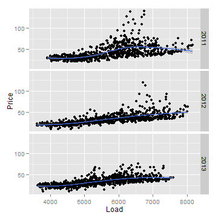
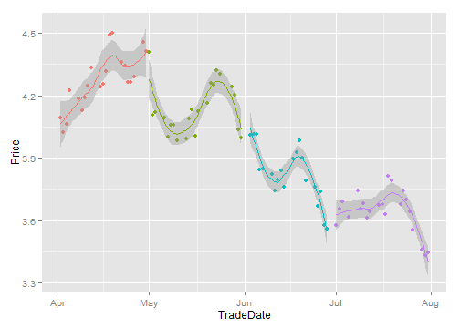
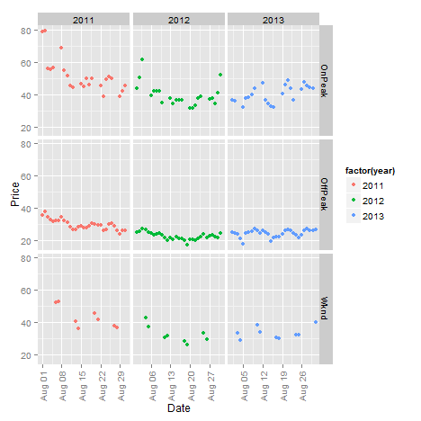
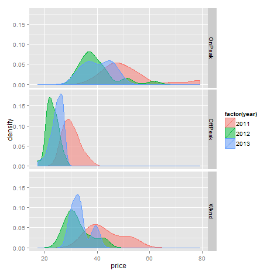

## Agenda

1. Introduce some basic concepts of the statistical computing language
2. Introduce two packages that are powerful and popular
3. Point to further uses of R with a fun example

---

## This is easier than you think:

> 1. R is a high level language that skips over most programming niceties
> 2. R has a big support community and more packages than you have time to explore
> 3. Anything you want to achieve, someone probably has done it in R, and done it beautifully

---

## Let's start with `ggplot2`

> * Contributed by Hadley Wickham of Rice University
> * Some data to start us off
> * Historical price-load relationship during August based on hourly PJM data
  

---

## What happened


```r
require(xlsx)
require(ggplot2)
priceload <- read.csv("C:\\Users\\Yangster\\Dropbox\\Private\\3AugHrlyLdPrice_PJM.csv")
p <- ggplot(priceload, aes(x = E_W_LD, y = Price)) + geom_point() + xlab("Load") + 
    ylab("Price")
p + facet_grid(Date ~ .)
p + facet_grid(Date ~ .) + geom_smooth()
```


With three simple lines of code, we
* Imported data from an Excel file
* Created elegant charts using `ggplot2`'s graphics language
  * using aesthetics (aes) to create mapping of data to graphic elements
  * using geometry (geom) to specify the way we want to present the data including sophisticated "faceting" and non-parametric regression

---

## Data visualization done right

Let's look at another example using historical forward data for Henry Hub natural gas for August 2013 delivery. Trade dates of each month are colored differently, a local regression line is produced as well as it's error bands.




---

## Some programming asides


```r
require(xlsx)
require(lubridate)
require(ggplot2)
futNGDel = read.xlsx("C:\\Users\\Yangster\\Dropbox\\Private\\FUTURE_NG_Del.xlsx", 
    2, header = TRUE)
s2 <- ggplot(data = subset(futNGDel, subset = year(DelMo) == 2013 & month(DelMo) == 
    8 & TradeDate > as.Date("4/1/2013", "%m/%d/%Y")), aes(x = TradeDate, y = Price, 
    colour = as.factor(month(TradeDate))))
s2 + geom_point() + geom_smooth() + theme(legend.position = "none")
```


> * We do need to mention some R-related programming knowledge such as the following
    * How to subset data
    * How to use `month()` and `year()` functions in the lubridate package to extract information from dates
    * How to convert dates stored as `factors` to dates stored as `dates` and back

---

## A lot more cool stuff awaits

Once we are more familiar with R, we can do a lot by typing relatively little. What's more important is probably the dynamic and reproducible nature of it.

Any guesses what the code below will do?


```r
require(xlsx)
require(lubridate)
require(ggplot2)
# Importing and processing of data
price.Seg = read.csv("C:\\Users\\Yangster\\Dropbox\\Private\\3AugHrlyLdPrice_PJM_2.csv", 
    header = TRUE)
price.Seg$Date_Long <- as.Date(price.Seg$Date_Long, "%m/%d/%Y")
price.Seg <- price.Seg[, c("Date_Long", "Date", "Price", "SegType")]
aggreg.Seg <- aggregate(price.Seg, list(price.Seg$SegType, price.Seg$Date_Long), 
    mean)
aggreg.Seg <- aggreg.Seg[, c(1, 2, 4, 5)]
names(aggreg.Seg) <- c("peaktype", "date", "year", "price")
```


---

## (continued from above)


```r
aggreg.Seg <- aggreg.Seg[order(aggreg.Seg$peaktype, aggreg.Seg$date), ]
aggreg.Seg$peaktype <- factor(aggreg.Seg$peaktype, levels = c("OnPeak", "OffPeak", 
    "Wknd"))
# Setting up plotting
p_seg <- ggplot(aggreg.Seg, aes(x = date, y = price, colour = factor(year))) + 
    geom_point() + xlab("Date") + ylab("Price")
p_seg + facet_grid(peaktype ~ year, scale = "free_x") + theme(axis.text.x = element_text(angle = 90, 
    vjust = 0.5))
p_seg_hist <- ggplot(aggreg.Seg, aes(x = price, fill = factor(year), colour = factor(year), 
    ..density..)) + geom_density(alpha = 0.5, position = "identity")
p_seg_hist + facet_grid(peaktype ~ ., scale = "free_x")
```


---

## Side-by-side comparison of August power prices by segment and year

  


---

## Now let's look at `forecast`

> * Contributed by Rob Hyndman of Monash University, Australia
> * An excellent source of information on time series modeling using R is here: https://www.otexts.org/fpp/resources
> * The package `forecast` enables complex methods to be invoked with just the right function call
> * We'll see an example using a double-seasonality Holt-Winters procedure to forecast hourly power prices using the same hourly PJM data
    * The double seasonality refers to both the daily cycle as well as the weekly (weekday/weekend) cycle
> * The example uses a training set of 600 hourly data; the forecast (blue) is compared to the actual out-of-sample data of hour number 601 to 744 (plotted in black)

---

## Automated time-series forecast


<!-- LineChart generated in R 3.0.2 by googleVis 0.4.7 package -->
<!-- Tue Jan 28 15:38:27 2014 -->


<!-- jsHeader -->
<script type="text/javascript">
 
// jsData 
function gvisDataLineChartID22d47d532f4 () {
var data = new google.visualization.DataTable();
var datajson =
[
 [
 new Date(2012,7,1,1,0,0),
26.97,
26.97 
],
[
 new Date(2012,7,1,2,0,0),
24.54,
24.54 
],
[
 new Date(2012,7,1,3,0,0),
22.38,
22.38 
],
[
 new Date(2012,7,1,4,0,0),
21.6,
21.6 
],
[
 new Date(2012,7,1,5,0,0),
21.37,
21.37 
],
[
 new Date(2012,7,1,6,0,0),
23.12,
23.12 
],
[
 new Date(2012,7,1,7,0,0),
26.76,
26.76 
],
[
 new Date(2012,7,1,8,0,0),
29.36,
29.36 
],
[
 new Date(2012,7,1,9,0,0),
31.81,
31.81 
],
[
 new Date(2012,7,1,10,0,0),
34.58,
34.58 
],
[
 new Date(2012,7,1,11,0,0),
38.91,
38.91 
],
[
 new Date(2012,7,1,12,0,0),
40.85,
40.85 
],
[
 new Date(2012,7,1,13,0,0),
43.38,
43.38 
],
[
 new Date(2012,7,1,14,0,0),
47.81,
47.81 
],
[
 new Date(2012,7,1,15,0,0),
53.33,
53.33 
],
[
 new Date(2012,7,1,16,0,0),
59.99,
59.99 
],
[
 new Date(2012,7,1,17,0,0),
69.76,
69.76 
],
[
 new Date(2012,7,1,18,0,0),
55.6,
55.6 
],
[
 new Date(2012,7,1,19,0,0),
47.59,
47.59 
],
[
 new Date(2012,7,1,20,0,0),
40.65,
40.65 
],
[
 new Date(2012,7,1,21,0,0),
40.12,
40.12 
],
[
 new Date(2012,7,1,22,0,0),
37.75,
37.75 
],
[
 new Date(2012,7,1,23,0,0),
33.09,
33.09 
],
[
 new Date(2012,7,2,0,0,0),
28.92,
28.92 
],
[
 new Date(2012,7,2,1,0,0),
27.34,
27.34 
],
[
 new Date(2012,7,2,2,0,0),
24.22,
24.22 
],
[
 new Date(2012,7,2,3,0,0),
22.17,
22.17 
],
[
 new Date(2012,7,2,4,0,0),
21.44,
21.44 
],
[
 new Date(2012,7,2,5,0,0),
21.12,
21.12 
],
[
 new Date(2012,7,2,6,0,0),
22.44,
22.44 
],
[
 new Date(2012,7,2,7,0,0),
26.24,
26.24 
],
[
 new Date(2012,7,2,8,0,0),
28.48,
28.48 
],
[
 new Date(2012,7,2,9,0,0),
31.86,
31.86 
],
[
 new Date(2012,7,2,10,0,0),
35.17,
35.17 
],
[
 new Date(2012,7,2,11,0,0),
41.24,
41.24 
],
[
 new Date(2012,7,2,12,0,0),
45.28,
45.28 
],
[
 new Date(2012,7,2,13,0,0),
47.82,
47.82 
],
[
 new Date(2012,7,2,14,0,0),
53.38,
53.38 
],
[
 new Date(2012,7,2,15,0,0),
64.6,
64.6 
],
[
 new Date(2012,7,2,16,0,0),
73.98,
73.98 
],
[
 new Date(2012,7,2,17,0,0),
86.28,
86.28 
],
[
 new Date(2012,7,2,18,0,0),
78.5,
78.5 
],
[
 new Date(2012,7,2,19,0,0),
54.31,
54.31 
],
[
 new Date(2012,7,2,20,0,0),
51.01,
51.01 
],
[
 new Date(2012,7,2,21,0,0),
49.3,
49.3 
],
[
 new Date(2012,7,2,22,0,0),
43,
43 
],
[
 new Date(2012,7,2,23,0,0),
35.94,
35.94 
],
[
 new Date(2012,7,3,0,0,0),
32.1,
32.1 
],
[
 new Date(2012,7,3,1,0,0),
30.1,
30.1 
],
[
 new Date(2012,7,3,2,0,0),
26.44,
26.44 
],
[
 new Date(2012,7,3,3,0,0),
24.3,
24.3 
],
[
 new Date(2012,7,3,4,0,0),
23.27,
23.27 
],
[
 new Date(2012,7,3,5,0,0),
23.08,
23.08 
],
[
 new Date(2012,7,3,6,0,0),
24.84,
24.84 
],
[
 new Date(2012,7,3,7,0,0),
27.96,
27.96 
],
[
 new Date(2012,7,3,8,0,0),
30.88,
30.88 
],
[
 new Date(2012,7,3,9,0,0),
34.09,
34.09 
],
[
 new Date(2012,7,3,10,0,0),
41.17,
41.17 
],
[
 new Date(2012,7,3,11,0,0),
46.47,
46.47 
],
[
 new Date(2012,7,3,12,0,0),
53.26,
53.26 
],
[
 new Date(2012,7,3,13,0,0),
60.52,
60.52 
],
[
 new Date(2012,7,3,14,0,0),
75.65,
75.65 
],
[
 new Date(2012,7,3,15,0,0),
92.19,
92.19 
],
[
 new Date(2012,7,3,16,0,0),
119.42,
119.42 
],
[
 new Date(2012,7,3,17,0,0),
112.68,
112.68 
],
[
 new Date(2012,7,3,18,0,0),
89.23,
89.23 
],
[
 new Date(2012,7,3,19,0,0),
62.71,
62.71 
],
[
 new Date(2012,7,3,20,0,0),
49.93,
49.93 
],
[
 new Date(2012,7,3,21,0,0),
46.73,
46.73 
],
[
 new Date(2012,7,3,22,0,0),
43.95,
43.95 
],
[
 new Date(2012,7,3,23,0,0),
36.94,
36.94 
],
[
 new Date(2012,7,4,0,0,0),
32.97,
32.97 
],
[
 new Date(2012,7,4,1,0,0),
30.42,
30.42 
],
[
 new Date(2012,7,4,2,0,0),
27.5,
27.5 
],
[
 new Date(2012,7,4,3,0,0),
25.07,
25.07 
],
[
 new Date(2012,7,4,4,0,0),
23.64,
23.64 
],
[
 new Date(2012,7,4,5,0,0),
21.94,
21.94 
],
[
 new Date(2012,7,4,6,0,0),
22.06,
22.06 
],
[
 new Date(2012,7,4,7,0,0),
22.29,
22.29 
],
[
 new Date(2012,7,4,8,0,0),
25.22,
25.22 
],
[
 new Date(2012,7,4,9,0,0),
29.46,
29.46 
],
[
 new Date(2012,7,4,10,0,0),
34.33,
34.33 
],
[
 new Date(2012,7,4,11,0,0),
39.82,
39.82 
],
[
 new Date(2012,7,4,12,0,0),
43.63,
43.63 
],
[
 new Date(2012,7,4,13,0,0),
44.88,
44.88 
],
[
 new Date(2012,7,4,14,0,0),
46.99,
46.99 
],
[
 new Date(2012,7,4,15,0,0),
52.72,
52.72 
],
[
 new Date(2012,7,4,16,0,0),
59.69,
59.69 
],
[
 new Date(2012,7,4,17,0,0),
62.47,
62.47 
],
[
 new Date(2012,7,4,18,0,0),
54.84,
54.84 
],
[
 new Date(2012,7,4,19,0,0),
45.81,
45.81 
],
[
 new Date(2012,7,4,20,0,0),
41.98,
41.98 
],
[
 new Date(2012,7,4,21,0,0),
39.21,
39.21 
],
[
 new Date(2012,7,4,22,0,0),
37.47,
37.47 
],
[
 new Date(2012,7,4,23,0,0),
33.93,
33.93 
],
[
 new Date(2012,7,5,0,0,0),
30.1,
30.1 
],
[
 new Date(2012,7,5,1,0,0),
28.9,
28.9 
],
[
 new Date(2012,7,5,2,0,0),
25.92,
25.92 
],
[
 new Date(2012,7,5,3,0,0),
24.19,
24.19 
],
[
 new Date(2012,7,5,4,0,0),
22.71,
22.71 
],
[
 new Date(2012,7,5,5,0,0),
21.58,
21.58 
],
[
 new Date(2012,7,5,6,0,0),
21.34,
21.34 
],
[
 new Date(2012,7,5,7,0,0),
20.74,
20.74 
],
[
 new Date(2012,7,5,8,0,0),
22.25,
22.25 
],
[
 new Date(2012,7,5,9,0,0),
27.44,
27.44 
],
[
 new Date(2012,7,5,10,0,0),
31.96,
31.96 
],
[
 new Date(2012,7,5,11,0,0),
35.28,
35.28 
],
[
 new Date(2012,7,5,12,0,0),
39.8,
39.8 
],
[
 new Date(2012,7,5,13,0,0),
41.34,
41.34 
],
[
 new Date(2012,7,5,14,0,0),
43.52,
43.52 
],
[
 new Date(2012,7,5,15,0,0),
45.76,
45.76 
],
[
 new Date(2012,7,5,16,0,0),
45.01,
45.01 
],
[
 new Date(2012,7,5,17,0,0),
45.79,
45.79 
],
[
 new Date(2012,7,5,18,0,0),
43.78,
43.78 
],
[
 new Date(2012,7,5,19,0,0),
41.46,
41.46 
],
[
 new Date(2012,7,5,20,0,0),
38.75,
38.75 
],
[
 new Date(2012,7,5,21,0,0),
38.78,
38.78 
],
[
 new Date(2012,7,5,22,0,0),
34.44,
34.44 
],
[
 new Date(2012,7,5,23,0,0),
31.77,
31.77 
],
[
 new Date(2012,7,6,0,0,0),
27.56,
27.56 
],
[
 new Date(2012,7,6,1,0,0),
26.88,
26.88 
],
[
 new Date(2012,7,6,2,0,0),
24.53,
24.53 
],
[
 new Date(2012,7,6,3,0,0),
22.74,
22.74 
],
[
 new Date(2012,7,6,4,0,0),
22.2,
22.2 
],
[
 new Date(2012,7,6,5,0,0),
21.51,
21.51 
],
[
 new Date(2012,7,6,6,0,0),
23.45,
23.45 
],
[
 new Date(2012,7,6,7,0,0),
26.39,
26.39 
],
[
 new Date(2012,7,6,8,0,0),
27.91,
27.91 
],
[
 new Date(2012,7,6,9,0,0),
30.52,
30.52 
],
[
 new Date(2012,7,6,10,0,0),
34.53,
34.53 
],
[
 new Date(2012,7,6,11,0,0),
38.04,
38.04 
],
[
 new Date(2012,7,6,12,0,0),
40.09,
40.09 
],
[
 new Date(2012,7,6,13,0,0),
42.14,
42.14 
],
[
 new Date(2012,7,6,14,0,0),
43.49,
43.49 
],
[
 new Date(2012,7,6,15,0,0),
47.12,
47.12 
],
[
 new Date(2012,7,6,16,0,0),
48.02,
48.02 
],
[
 new Date(2012,7,6,17,0,0),
49.19,
49.19 
],
[
 new Date(2012,7,6,18,0,0),
47.13,
47.13 
],
[
 new Date(2012,7,6,19,0,0),
39.37,
39.37 
],
[
 new Date(2012,7,6,20,0,0),
38.2,
38.2 
],
[
 new Date(2012,7,6,21,0,0),
37.88,
37.88 
],
[
 new Date(2012,7,6,22,0,0),
34.64,
34.64 
],
[
 new Date(2012,7,6,23,0,0),
30.33,
30.33 
],
[
 new Date(2012,7,7,0,0,0),
27,
27 
],
[
 new Date(2012,7,7,1,0,0),
25.45,
25.45 
],
[
 new Date(2012,7,7,2,0,0),
22.49,
22.49 
],
[
 new Date(2012,7,7,3,0,0),
20.82,
20.82 
],
[
 new Date(2012,7,7,4,0,0),
19.1,
19.1 
],
[
 new Date(2012,7,7,5,0,0),
18.53,
18.53 
],
[
 new Date(2012,7,7,6,0,0),
21.13,
21.13 
],
[
 new Date(2012,7,7,7,0,0),
23.79,
23.79 
],
[
 new Date(2012,7,7,8,0,0),
27.12,
27.12 
],
[
 new Date(2012,7,7,9,0,0),
29.85,
29.85 
],
[
 new Date(2012,7,7,10,0,0),
33.3,
33.3 
],
[
 new Date(2012,7,7,11,0,0),
38.57,
38.57 
],
[
 new Date(2012,7,7,12,0,0),
43.53,
43.53 
],
[
 new Date(2012,7,7,13,0,0),
43.69,
43.69 
],
[
 new Date(2012,7,7,14,0,0),
46.2,
46.2 
],
[
 new Date(2012,7,7,15,0,0),
48.43,
48.43 
],
[
 new Date(2012,7,7,16,0,0),
56.25,
56.25 
],
[
 new Date(2012,7,7,17,0,0),
66.69,
66.69 
],
[
 new Date(2012,7,7,18,0,0),
53.12,
53.12 
],
[
 new Date(2012,7,7,19,0,0),
44.68,
44.68 
],
[
 new Date(2012,7,7,20,0,0),
41.25,
41.25 
],
[
 new Date(2012,7,7,21,0,0),
39.94,
39.94 
],
[
 new Date(2012,7,7,22,0,0),
37.64,
37.64 
],
[
 new Date(2012,7,7,23,0,0),
32.76,
32.76 
],
[
 new Date(2012,7,8,0,0,0),
27.69,
27.69 
],
[
 new Date(2012,7,8,1,0,0),
25.49,
25.49 
],
[
 new Date(2012,7,8,2,0,0),
23.74,
23.74 
],
[
 new Date(2012,7,8,3,0,0),
21.79,
21.79 
],
[
 new Date(2012,7,8,4,0,0),
20.53,
20.53 
],
[
 new Date(2012,7,8,5,0,0),
20.2,
20.2 
],
[
 new Date(2012,7,8,6,0,0),
22.97,
22.97 
],
[
 new Date(2012,7,8,7,0,0),
24.65,
24.65 
],
[
 new Date(2012,7,8,8,0,0),
25.76,
25.76 
],
[
 new Date(2012,7,8,9,0,0),
28.34,
28.34 
],
[
 new Date(2012,7,8,10,0,0),
31.56,
31.56 
],
[
 new Date(2012,7,8,11,0,0),
36.23,
36.23 
],
[
 new Date(2012,7,8,12,0,0),
40.74,
40.74 
],
[
 new Date(2012,7,8,13,0,0),
41.39,
41.39 
],
[
 new Date(2012,7,8,14,0,0),
45.88,
45.88 
],
[
 new Date(2012,7,8,15,0,0),
53.39,
53.39 
],
[
 new Date(2012,7,8,16,0,0),
60.37,
60.37 
],
[
 new Date(2012,7,8,17,0,0),
69.91,
69.91 
],
[
 new Date(2012,7,8,18,0,0),
58.14,
58.14 
],
[
 new Date(2012,7,8,19,0,0),
45.25,
45.25 
],
[
 new Date(2012,7,8,20,0,0),
39.03,
39.03 
],
[
 new Date(2012,7,8,21,0,0),
38.4,
38.4 
],
[
 new Date(2012,7,8,22,0,0),
36.07,
36.07 
],
[
 new Date(2012,7,8,23,0,0),
31.53,
31.53 
],
[
 new Date(2012,7,9,0,0,0),
27.17,
27.17 
],
[
 new Date(2012,7,9,1,0,0),
26.48,
26.48 
],
[
 new Date(2012,7,9,2,0,0),
24.05,
24.05 
],
[
 new Date(2012,7,9,3,0,0),
22.13,
22.13 
],
[
 new Date(2012,7,9,4,0,0),
20.94,
20.94 
],
[
 new Date(2012,7,9,5,0,0),
20.69,
20.69 
],
[
 new Date(2012,7,9,6,0,0),
22.9,
22.9 
],
[
 new Date(2012,7,9,7,0,0),
25.1,
25.1 
],
[
 new Date(2012,7,9,8,0,0),
27.82,
27.82 
],
[
 new Date(2012,7,9,9,0,0),
30.34,
30.34 
],
[
 new Date(2012,7,9,10,0,0),
33.69,
33.69 
],
[
 new Date(2012,7,9,11,0,0),
38.06,
38.06 
],
[
 new Date(2012,7,9,12,0,0),
41.54,
41.54 
],
[
 new Date(2012,7,9,13,0,0),
43.84,
43.84 
],
[
 new Date(2012,7,9,14,0,0),
50.7,
50.7 
],
[
 new Date(2012,7,9,15,0,0),
58.47,
58.47 
],
[
 new Date(2012,7,9,16,0,0),
60.02,
60.02 
],
[
 new Date(2012,7,9,17,0,0),
61.36,
61.36 
],
[
 new Date(2012,7,9,18,0,0),
49.31,
49.31 
],
[
 new Date(2012,7,9,19,0,0),
40.59,
40.59 
],
[
 new Date(2012,7,9,20,0,0),
37.13,
37.13 
],
[
 new Date(2012,7,9,21,0,0),
37.01,
37.01 
],
[
 new Date(2012,7,9,22,0,0),
34.35,
34.35 
],
[
 new Date(2012,7,9,23,0,0),
31.38,
31.38 
],
[
 new Date(2012,7,10,0,0,0),
27.14,
27.14 
],
[
 new Date(2012,7,10,1,0,0),
25.81,
25.81 
],
[
 new Date(2012,7,10,2,0,0),
23.44,
23.44 
],
[
 new Date(2012,7,10,3,0,0),
21.83,
21.83 
],
[
 new Date(2012,7,10,4,0,0),
20.39,
20.39 
],
[
 new Date(2012,7,10,5,0,0),
20.47,
20.47 
],
[
 new Date(2012,7,10,6,0,0),
22.37,
22.37 
],
[
 new Date(2012,7,10,7,0,0),
24.9,
24.9 
],
[
 new Date(2012,7,10,8,0,0),
26.98,
26.98 
],
[
 new Date(2012,7,10,9,0,0),
28.79,
28.79 
],
[
 new Date(2012,7,10,10,0,0),
32.57,
32.57 
],
[
 new Date(2012,7,10,11,0,0),
35.69,
35.69 
],
[
 new Date(2012,7,10,12,0,0),
38.72,
38.72 
],
[
 new Date(2012,7,10,13,0,0),
37.87,
37.87 
],
[
 new Date(2012,7,10,14,0,0),
40.89,
40.89 
],
[
 new Date(2012,7,10,15,0,0),
41.23,
41.23 
],
[
 new Date(2012,7,10,16,0,0),
41.08,
41.08 
],
[
 new Date(2012,7,10,17,0,0),
40.3,
40.3 
],
[
 new Date(2012,7,10,18,0,0),
37.44,
37.44 
],
[
 new Date(2012,7,10,19,0,0),
36.87,
36.87 
],
[
 new Date(2012,7,10,20,0,0),
33.93,
33.93 
],
[
 new Date(2012,7,10,21,0,0),
33.24,
33.24 
],
[
 new Date(2012,7,10,22,0,0),
30.97,
30.97 
],
[
 new Date(2012,7,10,23,0,0),
28.35,
28.35 
],
[
 new Date(2012,7,11,0,0,0),
25.47,
25.47 
],
[
 new Date(2012,7,11,1,0,0),
23.95,
23.95 
],
[
 new Date(2012,7,11,2,0,0),
22.95,
22.95 
],
[
 new Date(2012,7,11,3,0,0),
21.41,
21.41 
],
[
 new Date(2012,7,11,4,0,0),
19,
19 
],
[
 new Date(2012,7,11,5,0,0),
17.64,
17.64 
],
[
 new Date(2012,7,11,6,0,0),
18.14,
18.14 
],
[
 new Date(2012,7,11,7,0,0),
18.44,
18.44 
],
[
 new Date(2012,7,11,8,0,0),
20.45,
20.45 
],
[
 new Date(2012,7,11,9,0,0),
24.24,
24.24 
],
[
 new Date(2012,7,11,10,0,0),
27.88,
27.88 
],
[
 new Date(2012,7,11,11,0,0),
30.84,
30.84 
],
[
 new Date(2012,7,11,12,0,0),
33.71,
33.71 
],
[
 new Date(2012,7,11,13,0,0),
33.25,
33.25 
],
[
 new Date(2012,7,11,14,0,0),
33.91,
33.91 
],
[
 new Date(2012,7,11,15,0,0),
34.76,
34.76 
],
[
 new Date(2012,7,11,16,0,0),
35.42,
35.42 
],
[
 new Date(2012,7,11,17,0,0),
35.49,
35.49 
],
[
 new Date(2012,7,11,18,0,0),
34.14,
34.14 
],
[
 new Date(2012,7,11,19,0,0),
33.31,
33.31 
],
[
 new Date(2012,7,11,20,0,0),
31.29,
31.29 
],
[
 new Date(2012,7,11,21,0,0),
30.92,
30.92 
],
[
 new Date(2012,7,11,22,0,0),
29.76,
29.76 
],
[
 new Date(2012,7,11,23,0,0),
27.1,
27.1 
],
[
 new Date(2012,7,12,0,0,0),
24.38,
24.38 
],
[
 new Date(2012,7,12,1,0,0),
24.12,
24.12 
],
[
 new Date(2012,7,12,2,0,0),
23.12,
23.12 
],
[
 new Date(2012,7,12,3,0,0),
19.63,
19.63 
],
[
 new Date(2012,7,12,4,0,0),
17.64,
17.64 
],
[
 new Date(2012,7,12,5,0,0),
13.4,
13.4 
],
[
 new Date(2012,7,12,6,0,0),
13.1,
13.1 
],
[
 new Date(2012,7,12,7,0,0),
12.48,
12.48 
],
[
 new Date(2012,7,12,8,0,0),
16.6,
16.6 
],
[
 new Date(2012,7,12,9,0,0),
23.05,
23.05 
],
[
 new Date(2012,7,12,10,0,0),
26.03,
26.03 
],
[
 new Date(2012,7,12,11,0,0),
28.81,
28.81 
],
[
 new Date(2012,7,12,12,0,0),
32.96,
32.96 
],
[
 new Date(2012,7,12,13,0,0),
34.71,
34.71 
],
[
 new Date(2012,7,12,14,0,0),
35.27,
35.27 
],
[
 new Date(2012,7,12,15,0,0),
37.85,
37.85 
],
[
 new Date(2012,7,12,16,0,0),
39.66,
39.66 
],
[
 new Date(2012,7,12,17,0,0),
40.8,
40.8 
],
[
 new Date(2012,7,12,18,0,0),
39.99,
39.99 
],
[
 new Date(2012,7,12,19,0,0),
35.47,
35.47 
],
[
 new Date(2012,7,12,20,0,0),
34.69,
34.69 
],
[
 new Date(2012,7,12,21,0,0),
35.36,
35.36 
],
[
 new Date(2012,7,12,22,0,0),
31.04,
31.04 
],
[
 new Date(2012,7,12,23,0,0),
27.49,
27.49 
],
[
 new Date(2012,7,13,0,0,0),
24.68,
24.68 
],
[
 new Date(2012,7,13,1,0,0),
23.45,
23.45 
],
[
 new Date(2012,7,13,2,0,0),
22.11,
22.11 
],
[
 new Date(2012,7,13,3,0,0),
19.56,
19.56 
],
[
 new Date(2012,7,13,4,0,0),
18.47,
18.47 
],
[
 new Date(2012,7,13,5,0,0),
17.81,
17.81 
],
[
 new Date(2012,7,13,6,0,0),
22.26,
22.26 
],
[
 new Date(2012,7,13,7,0,0),
23.62,
23.62 
],
[
 new Date(2012,7,13,8,0,0),
25.9,
25.9 
],
[
 new Date(2012,7,13,9,0,0),
28,
28 
],
[
 new Date(2012,7,13,10,0,0),
30.32,
30.32 
],
[
 new Date(2012,7,13,11,0,0),
33.93,
33.93 
],
[
 new Date(2012,7,13,12,0,0),
37.98,
37.98 
],
[
 new Date(2012,7,13,13,0,0),
39.53,
39.53 
],
[
 new Date(2012,7,13,14,0,0),
41.32,
41.32 
],
[
 new Date(2012,7,13,15,0,0),
46.42,
46.42 
],
[
 new Date(2012,7,13,16,0,0),
55.39,
55.39 
],
[
 new Date(2012,7,13,17,0,0),
52.52,
52.52 
],
[
 new Date(2012,7,13,18,0,0),
45.03,
45.03 
],
[
 new Date(2012,7,13,19,0,0),
39.09,
39.09 
],
[
 new Date(2012,7,13,20,0,0),
35.18,
35.18 
],
[
 new Date(2012,7,13,21,0,0),
36.7,
36.7 
],
[
 new Date(2012,7,13,22,0,0),
33.35,
33.35 
],
[
 new Date(2012,7,13,23,0,0),
28.02,
28.02 
],
[
 new Date(2012,7,14,0,0,0),
25.85,
25.85 
],
[
 new Date(2012,7,14,1,0,0),
23.75,
23.75 
],
[
 new Date(2012,7,14,2,0,0),
21.33,
21.33 
],
[
 new Date(2012,7,14,3,0,0),
18.59,
18.59 
],
[
 new Date(2012,7,14,4,0,0),
16.38,
16.38 
],
[
 new Date(2012,7,14,5,0,0),
16.28,
16.28 
],
[
 new Date(2012,7,14,6,0,0),
19.35,
19.35 
],
[
 new Date(2012,7,14,7,0,0),
22.82,
22.82 
],
[
 new Date(2012,7,14,8,0,0),
24.01,
24.01 
],
[
 new Date(2012,7,14,9,0,0),
26.49,
26.49 
],
[
 new Date(2012,7,14,10,0,0),
29.48,
29.48 
],
[
 new Date(2012,7,14,11,0,0),
33.69,
33.69 
],
[
 new Date(2012,7,14,12,0,0),
35.84,
35.84 
],
[
 new Date(2012,7,14,13,0,0),
36.49,
36.49 
],
[
 new Date(2012,7,14,14,0,0),
38.86,
38.86 
],
[
 new Date(2012,7,14,15,0,0),
40.41,
40.41 
],
[
 new Date(2012,7,14,16,0,0),
42.52,
42.52 
],
[
 new Date(2012,7,14,17,0,0),
42.18,
42.18 
],
[
 new Date(2012,7,14,18,0,0),
38.09,
38.09 
],
[
 new Date(2012,7,14,19,0,0),
35.75,
35.75 
],
[
 new Date(2012,7,14,20,0,0),
34.45,
34.45 
],
[
 new Date(2012,7,14,21,0,0),
33.58,
33.58 
],
[
 new Date(2012,7,14,22,0,0),
31.69,
31.69 
],
[
 new Date(2012,7,14,23,0,0),
28.31,
28.31 
],
[
 new Date(2012,7,15,0,0,0),
24.57,
24.57 
],
[
 new Date(2012,7,15,1,0,0),
23.63,
23.63 
],
[
 new Date(2012,7,15,2,0,0),
22.11,
22.11 
],
[
 new Date(2012,7,15,3,0,0),
20.98,
20.98 
],
[
 new Date(2012,7,15,4,0,0),
19.31,
19.31 
],
[
 new Date(2012,7,15,5,0,0),
19.15,
19.15 
],
[
 new Date(2012,7,15,6,0,0),
22.08,
22.08 
],
[
 new Date(2012,7,15,7,0,0),
24.28,
24.28 
],
[
 new Date(2012,7,15,8,0,0),
25.51,
25.51 
],
[
 new Date(2012,7,15,9,0,0),
27.03,
27.03 
],
[
 new Date(2012,7,15,10,0,0),
29.51,
29.51 
],
[
 new Date(2012,7,15,11,0,0),
33.75,
33.75 
],
[
 new Date(2012,7,15,12,0,0),
36.85,
36.85 
],
[
 new Date(2012,7,15,13,0,0),
37.38,
37.38 
],
[
 new Date(2012,7,15,14,0,0),
38.55,
38.55 
],
[
 new Date(2012,7,15,15,0,0),
41.94,
41.94 
],
[
 new Date(2012,7,15,16,0,0),
46.89,
46.89 
],
[
 new Date(2012,7,15,17,0,0),
51.44,
51.44 
],
[
 new Date(2012,7,15,18,0,0),
44.92,
44.92 
],
[
 new Date(2012,7,15,19,0,0),
38.07,
38.07 
],
[
 new Date(2012,7,15,20,0,0),
37.07,
37.07 
],
[
 new Date(2012,7,15,21,0,0),
35.26,
35.26 
],
[
 new Date(2012,7,15,22,0,0),
32.84,
32.84 
],
[
 new Date(2012,7,15,23,0,0),
28.98,
28.98 
],
[
 new Date(2012,7,16,0,0,0),
24.82,
24.82 
],
[
 new Date(2012,7,16,1,0,0),
24.15,
24.15 
],
[
 new Date(2012,7,16,2,0,0),
22.06,
22.06 
],
[
 new Date(2012,7,16,3,0,0),
18.91,
18.91 
],
[
 new Date(2012,7,16,4,0,0),
17.54,
17.54 
],
[
 new Date(2012,7,16,5,0,0),
16.46,
16.46 
],
[
 new Date(2012,7,16,6,0,0),
19.3,
19.3 
],
[
 new Date(2012,7,16,7,0,0),
23.13,
23.13 
],
[
 new Date(2012,7,16,8,0,0),
25.56,
25.56 
],
[
 new Date(2012,7,16,9,0,0),
26.13,
26.13 
],
[
 new Date(2012,7,16,10,0,0),
29.6,
29.6 
],
[
 new Date(2012,7,16,11,0,0),
33.73,
33.73 
],
[
 new Date(2012,7,16,12,0,0),
36.14,
36.14 
],
[
 new Date(2012,7,16,13,0,0),
37.44,
37.44 
],
[
 new Date(2012,7,16,14,0,0),
40.9,
40.9 
],
[
 new Date(2012,7,16,15,0,0),
44.62,
44.62 
],
[
 new Date(2012,7,16,16,0,0),
49.54,
49.54 
],
[
 new Date(2012,7,16,17,0,0),
51.62,
51.62 
],
[
 new Date(2012,7,16,18,0,0),
46.24,
46.24 
],
[
 new Date(2012,7,16,19,0,0),
38.16,
38.16 
],
[
 new Date(2012,7,16,20,0,0),
35.52,
35.52 
],
[
 new Date(2012,7,16,21,0,0),
35.44,
35.44 
],
[
 new Date(2012,7,16,22,0,0),
33.21,
33.21 
],
[
 new Date(2012,7,16,23,0,0),
28.15,
28.15 
],
[
 new Date(2012,7,17,0,0,0),
25.36,
25.36 
],
[
 new Date(2012,7,17,1,0,0),
24.22,
24.22 
],
[
 new Date(2012,7,17,2,0,0),
22.16,
22.16 
],
[
 new Date(2012,7,17,3,0,0),
19.19,
19.19 
],
[
 new Date(2012,7,17,4,0,0),
18.14,
18.14 
],
[
 new Date(2012,7,17,5,0,0),
17.87,
17.87 
],
[
 new Date(2012,7,17,6,0,0),
20.23,
20.23 
],
[
 new Date(2012,7,17,7,0,0),
23.4,
23.4 
],
[
 new Date(2012,7,17,8,0,0),
25.13,
25.13 
],
[
 new Date(2012,7,17,9,0,0),
26.72,
26.72 
],
[
 new Date(2012,7,17,10,0,0),
30.32,
30.32 
],
[
 new Date(2012,7,17,11,0,0),
34.33,
34.33 
],
[
 new Date(2012,7,17,12,0,0),
38.66,
38.66 
],
[
 new Date(2012,7,17,13,0,0),
41.66,
41.66 
],
[
 new Date(2012,7,17,14,0,0),
45.08,
45.08 
],
[
 new Date(2012,7,17,15,0,0),
47.26,
47.26 
],
[
 new Date(2012,7,17,16,0,0),
49.72,
49.72 
],
[
 new Date(2012,7,17,17,0,0),
47.38,
47.38 
],
[
 new Date(2012,7,17,18,0,0),
42.39,
42.39 
],
[
 new Date(2012,7,17,19,0,0),
34.59,
34.59 
],
[
 new Date(2012,7,17,20,0,0),
32.29,
32.29 
],
[
 new Date(2012,7,17,21,0,0),
32.52,
32.52 
],
[
 new Date(2012,7,17,22,0,0),
29.86,
29.86 
],
[
 new Date(2012,7,17,23,0,0),
26.59,
26.59 
],
[
 new Date(2012,7,18,0,0,0),
24.61,
24.61 
],
[
 new Date(2012,7,18,1,0,0),
23.08,
23.08 
],
[
 new Date(2012,7,18,2,0,0),
21.43,
21.43 
],
[
 new Date(2012,7,18,3,0,0),
20.04,
20.04 
],
[
 new Date(2012,7,18,4,0,0),
17.08,
17.08 
],
[
 new Date(2012,7,18,5,0,0),
15.97,
15.97 
],
[
 new Date(2012,7,18,6,0,0),
16.63,
16.63 
],
[
 new Date(2012,7,18,7,0,0),
17.36,
17.36 
],
[
 new Date(2012,7,18,8,0,0),
19.48,
19.48 
],
[
 new Date(2012,7,18,9,0,0),
23.79,
23.79 
],
[
 new Date(2012,7,18,10,0,0),
26.51,
26.51 
],
[
 new Date(2012,7,18,11,0,0),
29.09,
29.09 
],
[
 new Date(2012,7,18,12,0,0),
30.05,
30.05 
],
[
 new Date(2012,7,18,13,0,0),
30.64,
30.64 
],
[
 new Date(2012,7,18,14,0,0),
31.45,
31.45 
],
[
 new Date(2012,7,18,15,0,0),
31.49,
31.49 
],
[
 new Date(2012,7,18,16,0,0),
32.23,
32.23 
],
[
 new Date(2012,7,18,17,0,0),
32.91,
32.91 
],
[
 new Date(2012,7,18,18,0,0),
32.72,
32.72 
],
[
 new Date(2012,7,18,19,0,0),
30.87,
30.87 
],
[
 new Date(2012,7,18,20,0,0),
30.02,
30.02 
],
[
 new Date(2012,7,18,21,0,0),
29.49,
29.49 
],
[
 new Date(2012,7,18,22,0,0),
27.56,
27.56 
],
[
 new Date(2012,7,18,23,0,0),
24.48,
24.48 
],
[
 new Date(2012,7,19,0,0,0),
22.99,
22.99 
],
[
 new Date(2012,7,19,1,0,0),
21.66,
21.66 
],
[
 new Date(2012,7,19,2,0,0),
20.74,
20.74 
],
[
 new Date(2012,7,19,3,0,0),
16.39,
16.39 
],
[
 new Date(2012,7,19,4,0,0),
12.1,
12.1 
],
[
 new Date(2012,7,19,5,0,0),
9.92,
9.92 
],
[
 new Date(2012,7,19,6,0,0),
9.93,
9.93 
],
[
 new Date(2012,7,19,7,0,0),
9.88,
9.88 
],
[
 new Date(2012,7,19,8,0,0),
12.38,
12.38 
],
[
 new Date(2012,7,19,9,0,0),
21.85,
21.85 
],
[
 new Date(2012,7,19,10,0,0),
23.08,
23.08 
],
[
 new Date(2012,7,19,11,0,0),
24.49,
24.49 
],
[
 new Date(2012,7,19,12,0,0),
26.87,
26.87 
],
[
 new Date(2012,7,19,13,0,0),
28.55,
28.55 
],
[
 new Date(2012,7,19,14,0,0),
29.7,
29.7 
],
[
 new Date(2012,7,19,15,0,0),
30.1,
30.1 
],
[
 new Date(2012,7,19,16,0,0),
31.23,
31.23 
],
[
 new Date(2012,7,19,17,0,0),
34.04,
34.04 
],
[
 new Date(2012,7,19,18,0,0),
33.02,
33.02 
],
[
 new Date(2012,7,19,19,0,0),
29.81,
29.81 
],
[
 new Date(2012,7,19,20,0,0),
29.64,
29.64 
],
[
 new Date(2012,7,19,21,0,0),
30.45,
30.45 
],
[
 new Date(2012,7,19,22,0,0),
27.24,
27.24 
],
[
 new Date(2012,7,19,23,0,0),
24.45,
24.45 
],
[
 new Date(2012,7,20,0,0,0),
23.08,
23.08 
],
[
 new Date(2012,7,20,1,0,0),
22.62,
22.62 
],
[
 new Date(2012,7,20,2,0,0),
20.66,
20.66 
],
[
 new Date(2012,7,20,3,0,0),
18.1,
18.1 
],
[
 new Date(2012,7,20,4,0,0),
17.74,
17.74 
],
[
 new Date(2012,7,20,5,0,0),
17.85,
17.85 
],
[
 new Date(2012,7,20,6,0,0),
20.61,
20.61 
],
[
 new Date(2012,7,20,7,0,0),
23.12,
23.12 
],
[
 new Date(2012,7,20,8,0,0),
24.27,
24.27 
],
[
 new Date(2012,7,20,9,0,0),
25.76,
25.76 
],
[
 new Date(2012,7,20,10,0,0),
27.83,
27.83 
],
[
 new Date(2012,7,20,11,0,0),
30.68,
30.68 
],
[
 new Date(2012,7,20,12,0,0),
34.64,
34.64 
],
[
 new Date(2012,7,20,13,0,0),
35,
35 
],
[
 new Date(2012,7,20,14,0,0),
35.25,
35.25 
],
[
 new Date(2012,7,20,15,0,0),
36.19,
36.19 
],
[
 new Date(2012,7,20,16,0,0),
36.06,
36.06 
],
[
 new Date(2012,7,20,17,0,0),
35.81,
35.81 
],
[
 new Date(2012,7,20,18,0,0),
33.78,
33.78 
],
[
 new Date(2012,7,20,19,0,0),
33.18,
33.18 
],
[
 new Date(2012,7,20,20,0,0),
31.31,
31.31 
],
[
 new Date(2012,7,20,21,0,0),
32.26,
32.26 
],
[
 new Date(2012,7,20,22,0,0),
28.29,
28.29 
],
[
 new Date(2012,7,20,23,0,0),
25.48,
25.48 
],
[
 new Date(2012,7,21,0,0,0),
24,
24 
],
[
 new Date(2012,7,21,1,0,0),
21.93,
21.93 
],
[
 new Date(2012,7,21,2,0,0),
19.78,
19.78 
],
[
 new Date(2012,7,21,3,0,0),
18.26,
18.26 
],
[
 new Date(2012,7,21,4,0,0),
17.33,
17.33 
],
[
 new Date(2012,7,21,5,0,0),
17.63,
17.63 
],
[
 new Date(2012,7,21,6,0,0),
20.67,
20.67 
],
[
 new Date(2012,7,21,7,0,0),
22.87,
22.87 
],
[
 new Date(2012,7,21,8,0,0),
24.24,
24.24 
],
[
 new Date(2012,7,21,9,0,0),
24.62,
24.62 
],
[
 new Date(2012,7,21,10,0,0),
26.63,
26.63 
],
[
 new Date(2012,7,21,11,0,0),
29.17,
29.17 
],
[
 new Date(2012,7,21,12,0,0),
31.55,
31.55 
],
[
 new Date(2012,7,21,13,0,0),
33.77,
33.77 
],
[
 new Date(2012,7,21,14,0,0),
34.68,
34.68 
],
[
 new Date(2012,7,21,15,0,0),
37.32,
37.32 
],
[
 new Date(2012,7,21,16,0,0),
38.28,
38.28 
],
[
 new Date(2012,7,21,17,0,0),
38.7,
38.7 
],
[
 new Date(2012,7,21,18,0,0),
37.97,
37.97 
],
[
 new Date(2012,7,21,19,0,0),
33.68,
33.68 
],
[
 new Date(2012,7,21,20,0,0),
32.14,
32.14 
],
[
 new Date(2012,7,21,21,0,0),
32.98,
32.98 
],
[
 new Date(2012,7,21,22,0,0),
29.6,
29.6 
],
[
 new Date(2012,7,21,23,0,0),
25.42,
25.42 
],
[
 new Date(2012,7,22,0,0,0),
24.11,
24.11 
],
[
 new Date(2012,7,22,1,0,0),
22.18,
22.18 
],
[
 new Date(2012,7,22,2,0,0),
19.98,
19.98 
],
[
 new Date(2012,7,22,3,0,0),
17.87,
17.87 
],
[
 new Date(2012,7,22,4,0,0),
15.94,
15.94 
],
[
 new Date(2012,7,22,5,0,0),
16.69,
16.69 
],
[
 new Date(2012,7,22,6,0,0),
21.08,
21.08 
],
[
 new Date(2012,7,22,7,0,0),
23.03,
23.03 
],
[
 new Date(2012,7,22,8,0,0),
23.77,
23.77 
],
[
 new Date(2012,7,22,9,0,0),
24.96,
24.96 
],
[
 new Date(2012,7,22,10,0,0),
27,
27 
],
[
 new Date(2012,7,22,11,0,0),
30.48,
30.48 
],
[
 new Date(2012,7,22,12,0,0),
33.75,
33.75 
],
[
 new Date(2012,7,22,13,0,0),
35.16,
35.16 
],
[
 new Date(2012,7,22,14,0,0),
36.26,
36.26 
],
[
 new Date(2012,7,22,15,0,0),
39.07,
39.07 
],
[
 new Date(2012,7,22,16,0,0),
41.4,
41.4 
],
[
 new Date(2012,7,22,17,0,0),
44.16,
44.16 
],
[
 new Date(2012,7,22,18,0,0),
39.29,
39.29 
],
[
 new Date(2012,7,22,19,0,0),
34.15,
34.15 
],
[
 new Date(2012,7,22,20,0,0),
33.99,
33.99 
],
[
 new Date(2012,7,22,21,0,0),
34.64,
34.64 
],
[
 new Date(2012,7,22,22,0,0),
30.49,
30.49 
],
[
 new Date(2012,7,22,23,0,0),
26.17,
26.17 
],
[
 new Date(2012,7,23,0,0,0),
24.05,
24.05 
],
[
 new Date(2012,7,23,1,0,0),
23.03,
23.03 
],
[
 new Date(2012,7,23,2,0,0),
21.29,
21.29 
],
[
 new Date(2012,7,23,3,0,0),
18.28,
18.28 
],
[
 new Date(2012,7,23,4,0,0),
16.43,
16.43 
],
[
 new Date(2012,7,23,5,0,0),
17.03,
17.03 
],
[
 new Date(2012,7,23,6,0,0),
19.93,
19.93 
],
[
 new Date(2012,7,23,7,0,0),
22.86,
22.86 
],
[
 new Date(2012,7,23,8,0,0),
25.1,
25.1 
],
[
 new Date(2012,7,23,9,0,0),
26.2,
26.2 
],
[
 new Date(2012,7,23,10,0,0),
29.3,
29.3 
],
[
 new Date(2012,7,23,11,0,0),
33.94,
33.94 
],
[
 new Date(2012,7,23,12,0,0),
36.87,
36.87 
],
[
 new Date(2012,7,23,13,0,0),
38.01,
38.01 
],
[
 new Date(2012,7,23,14,0,0),
40.3,
40.3 
],
[
 new Date(2012,7,23,15,0,0),
44.6,
44.6 
],
[
 new Date(2012,7,23,16,0,0),
50.83,
50.83 
],
[
 new Date(2012,7,23,17,0,0),
56.8,
56.8 
],
[
 new Date(2012,7,23,18,0,0),
48.12,
48.12 
],
[
 new Date(2012,7,23,19,0,0),
39.81,
39.81 
],
[
 new Date(2012,7,23,20,0,0),
35.82,
35.82 
],
[
 new Date(2012,7,23,21,0,0),
35.82,
35.82 
],
[
 new Date(2012,7,23,22,0,0),
33.95,
33.95 
],
[
 new Date(2012,7,23,23,0,0),
28.6,
28.6 
],
[
 new Date(2012,7,24,0,0,0),
25.96,
25.96 
],
[
 new Date(2012,7,24,1,0,0),
24.47,
24.47 
],
[
 new Date(2012,7,24,2,0,0),
22.36,
22.36 
],
[
 new Date(2012,7,24,3,0,0),
20.25,
20.25 
],
[
 new Date(2012,7,24,4,0,0),
18.56,
18.56 
],
[
 new Date(2012,7,24,5,0,0),
18.23,
18.23 
],
[
 new Date(2012,7,24,6,0,0),
20.92,
20.92 
],
[
 new Date(2012,7,24,7,0,0),
23.16,
23.16 
],
[
 new Date(2012,7,24,8,0,0),
25.49,
25.49 
],
[
 new Date(2012,7,24,9,0,0),
27.55,
27.55 
],
[
 new Date(2012,7,24,10,0,0),
30.56,
30.56 
],
[
 new Date(2012,7,24,11,0,0),
34.73,
34.73 
],
[
 new Date(2012,7,24,12,0,0),
37.77,
37.77 
],
[
 new Date(2012,7,24,13,0,0),
39.4,
39.4 
],
[
 new Date(2012,7,24,14,0,0),
40.08,
40.08 
],
[
 new Date(2012,7,24,15,0,0),
47.25,
47.25 
],
[
 new Date(2012,7,24,16,0,0),
54.66,
54.66 
],
[
 new Date(2012,7,24,17,0,0),
62.18,
62.18 
],
[
 new Date(2012,7,24,18,0,0),
51.7,
51.7 
],
[
 new Date(2012,7,24,19,0,0),
39.04,
39.04 
],
[
 new Date(2012,7,24,20,0,0),
36.92,
36.92 
],
[
 new Date(2012,7,24,21,0,0),
36.46,
36.46 
],
[
 new Date(2012,7,24,22,0,0),
32.76,
32.76 
],
[
 new Date(2012,7,24,23,0,0),
29.03,
29.03 
],
[
 new Date(2012,7,25,0,0,0),
26.31,
26.31 
],
[
 new Date(2012,7,25,1,0,0),
25.31,
25.31 
],
[
 new Date(2012,7,25,2,0,0),
24.29,
24.29 
],
[
 new Date(2012,7,25,3,0,0),
24.06,
24.06 
],
[
 new Date(2012,7,25,4,0,0),
23.02,
23.02 
],
[
 new Date(2012,7,25,5,0,0),
21.84,
21.84 
],
[
 new Date(2012,7,25,6,0,0),
21.98,
21.98 
],
[
 new Date(2012,7,25,7,0,0),
22.15,
22.15 
],
[
 new Date(2012,7,25,8,0,0),
22.99,
22.99 
],
[
 new Date(2012,7,25,9,0,0),
24.76,
24.76 
],
[
 new Date(2012,7,25,10,0,0),
27.22,
27.22 
],
[
 new Date(2012,7,25,11,0,0),
29.89,
29.89 
],
[
 new Date(2012,7,25,12,0,0),
33.72,
33.72 
],
[
 new Date(2012,7,25,13,0,0),
34.07,
34.07 
],
[
 new Date(2012,7,25,14,0,0),
37.55,
37.55 
],
[
 new Date(2012,7,25,15,0,0),
39.27,
39.27 
],
[
 new Date(2012,7,25,16,0,0),
42.31,
42.31 
],
[
 new Date(2012,7,25,17,0,0),
45.15,
45.15 
],
[
 new Date(2012,7,25,18,0,0),
39.68,
39.68 
],
[
 new Date(2012,7,25,19,0,0),
35.03,
35.03 
],
[
 new Date(2012,7,25,20,0,0),
34.21,
34.21 
],
[
 new Date(2012,7,25,21,0,0),
34.54,
34.54 
],
[
 new Date(2012,7,25,22,0,0),
30.82,
30.82 
],
[
 new Date(2012,7,25,23,0,0),
27.22,
27.22 
],
[
 new Date(2012,7,26,0,0,0),
25.63,
25.63 
],
[
 new Date(2012,7,26,1,0,0),
25.18880443,
24.19 
],
[
 new Date(2012,7,26,2,0,0),
22.30101713,
22.68 
],
[
 new Date(2012,7,26,3,0,0),
20.59198538,
20.78 
],
[
 new Date(2012,7,26,4,0,0),
19.30302005,
18.59 
],
[
 new Date(2012,7,26,5,0,0),
18.33195703,
17.7 
],
[
 new Date(2012,7,26,6,0,0),
18.21160038,
17.61 
],
[
 new Date(2012,7,26,7,0,0),
17.70564959,
17.91 
],
[
 new Date(2012,7,26,8,0,0),
19.03799798,
17.76 
],
[
 new Date(2012,7,26,9,0,0),
23.49864717,
22.71 
],
[
 new Date(2012,7,26,10,0,0),
27.27904821,
24.39 
],
[
 new Date(2012,7,26,11,0,0),
30.19632817,
25.89 
],
[
 new Date(2012,7,26,12,0,0),
34.09107424,
29.03 
],
[
 new Date(2012,7,26,13,0,0),
35.46816106,
30.4 
],
[
 new Date(2012,7,26,14,0,0),
37.29421545,
33.41 
],
[
 new Date(2012,7,26,15,0,0),
39.26625899,
34.32 
],
[
 new Date(2012,7,26,16,0,0),
38.7568582,
34.48 
],
[
 new Date(2012,7,26,17,0,0),
39.36691939,
38.57 
],
[
 new Date(2012,7,26,18,0,0),
37.75375252,
38.2 
],
[
 new Date(2012,7,26,19,0,0),
35.66486533,
34.05 
],
[
 new Date(2012,7,26,20,0,0),
33.46872709,
32.47 
],
[
 new Date(2012,7,26,21,0,0),
33.51617862,
32.32 
],
[
 new Date(2012,7,26,22,0,0),
29.7086629,
29.61 
],
[
 new Date(2012,7,26,23,0,0),
27.40386345,
27.03 
],
[
 new Date(2012,7,27,0,0,0),
23.93024951,
24.79 
],
[
 new Date(2012,7,27,1,0,0),
23.30317347,
23.97 
],
[
 new Date(2012,7,27,2,0,0),
21.29488933,
22.09 
],
[
 new Date(2012,7,27,3,0,0),
19.69905221,
20.59 
],
[
 new Date(2012,7,27,4,0,0),
19.29984221,
19.74 
],
[
 new Date(2012,7,27,5,0,0),
18.78411054,
19.34 
],
[
 new Date(2012,7,27,6,0,0),
20.64783374,
21.85 
],
[
 new Date(2012,7,27,7,0,0),
23.29787024,
24.52 
],
[
 new Date(2012,7,27,8,0,0),
24.71281045,
26.45 
],
[
 new Date(2012,7,27,9,0,0),
27.07535881,
28.98 
],
[
 new Date(2012,7,27,10,0,0),
30.6510073,
31.58 
],
[
 new Date(2012,7,27,11,0,0),
33.8914682,
35.63 
],
[
 new Date(2012,7,27,12,0,0),
35.77846107,
38.4 
],
[
 new Date(2012,7,27,13,0,0),
37.6464515,
37.87 
],
[
 new Date(2012,7,27,14,0,0),
38.84813931,
40.71 
],
[
 new Date(2012,7,27,15,0,0),
42.15664546,
45.87 
],
[
 new Date(2012,7,27,16,0,0),
43.12940225,
51.65 
],
[
 new Date(2012,7,27,17,0,0),
44.08270812,
54.95 
],
[
 new Date(2012,7,27,18,0,0),
42.38450869,
40.76 
],
[
 new Date(2012,7,27,19,0,0),
35.4170412,
36.43 
],
[
 new Date(2012,7,27,20,0,0),
34.42989452,
33.88 
],
[
 new Date(2012,7,27,21,0,0),
34.22381624,
34.92 
],
[
 new Date(2012,7,27,22,0,0),
31.25098234,
32.84 
],
[
 new Date(2012,7,27,23,0,0),
27.40651183,
29.16 
],
[
 new Date(2012,7,28,0,0,0),
24.58571919,
26.87 
],
[
 new Date(2012,7,28,1,0,0),
23.19096225,
25.35 
],
[
 new Date(2012,7,28,2,0,0),
20.60898113,
23.45 
],
[
 new Date(2012,7,28,3,0,0),
19.16008607,
22.41 
],
[
 new Date(2012,7,28,4,0,0),
17.79612732,
20.95 
],
[
 new Date(2012,7,28,5,0,0),
17.50731933,
20.41 
],
[
 new Date(2012,7,28,6,0,0),
20.23759005,
22.99 
],
[
 new Date(2012,7,28,7,0,0),
22.94217635,
25 
],
[
 new Date(2012,7,28,8,0,0),
26.23092194,
26.77 
],
[
 new Date(2012,7,28,9,0,0),
28.95966936,
28.33 
],
[
 new Date(2012,7,28,10,0,0),
32.36155364,
32.26 
],
[
 new Date(2012,7,28,11,0,0),
37.62346407,
35.48 
],
[
 new Date(2012,7,28,12,0,0),
42.52808416,
36.96 
],
[
 new Date(2012,7,28,13,0,0),
42.82389627,
38.51 
],
[
 new Date(2012,7,28,14,0,0),
45.26566047,
39.37 
],
[
 new Date(2012,7,28,15,0,0),
47.54804113,
45.37 
],
[
 new Date(2012,7,28,16,0,0),
55.34498519,
51.57 
],
[
 new Date(2012,7,28,17,0,0),
65.52381229,
56.72 
],
[
 new Date(2012,7,28,18,0,0),
52.57520585,
46.53 
],
[
 new Date(2012,7,28,19,0,0),
44.14324771,
37.77 
],
[
 new Date(2012,7,28,20,0,0),
40.8811752,
35.32 
],
[
 new Date(2012,7,28,21,0,0),
39.64268463,
35.66 
],
[
 new Date(2012,7,28,22,0,0),
37.3050118,
32.28 
],
[
 new Date(2012,7,28,23,0,0),
32.51742978,
28.9 
],
[
 new Date(2012,7,29,0,0,0),
27.6887792,
26.03 
],
[
 new Date(2012,7,29,1,0,0),
25.50421472,
24.51 
],
[
 new Date(2012,7,29,2,0,0),
23.78885358,
22.4 
],
[
 new Date(2012,7,29,3,0,0),
21.8517089,
20.68 
],
[
 new Date(2012,7,29,4,0,0),
20.69119014,
19.31 
],
[
 new Date(2012,7,29,5,0,0),
20.48626319,
19.46 
],
[
 new Date(2012,7,29,6,0,0),
23.46831559,
22.25 
],
[
 new Date(2012,7,29,7,0,0),
25.27757485,
25.16 
],
[
 new Date(2012,7,29,8,0,0),
26.46936646,
26.64 
],
[
 new Date(2012,7,29,9,0,0),
29.15299782,
27.97 
],
[
 new Date(2012,7,29,10,0,0),
32.48859654,
30.47 
],
[
 new Date(2012,7,29,11,0,0),
37.42797512,
32.59 
],
[
 new Date(2012,7,29,12,0,0),
42.13296764,
33.81 
],
[
 new Date(2012,7,29,13,0,0),
42.93309727,
34.61 
],
[
 new Date(2012,7,29,14,0,0),
47.52920688,
35.57 
],
[
 new Date(2012,7,29,15,0,0),
55.39616971,
38.17 
],
[
 new Date(2012,7,29,16,0,0),
62.89688246,
41.65 
],
[
 new Date(2012,7,29,17,0,0),
72.79433328,
45.4 
],
[
 new Date(2012,7,29,18,0,0),
60.88486523,
39.43 
],
[
 new Date(2012,7,29,19,0,0),
47.42359017,
34.73 
],
[
 new Date(2012,7,29,20,0,0),
41.06375281,
34.38 
],
[
 new Date(2012,7,29,21,0,0),
40.41780597,
33.91 
],
[
 new Date(2012,7,29,22,0,0),
37.91188122,
31.41 
],
[
 new Date(2012,7,29,23,0,0),
33.18380251,
27.35 
],
[
 new Date(2012,7,30,0,0,0),
28.78764167,
23.95 
],
[
 new Date(2012,7,30,1,0,0),
28.03103502,
22.68 
],
[
 new Date(2012,7,30,2,0,0),
25.51265157,
20.33 
],
[
 new Date(2012,7,30,3,0,0),
23.44226986,
19.38 
],
[
 new Date(2012,7,30,4,0,0),
22.25483967,
17.95 
],
[
 new Date(2012,7,30,5,0,0),
22.03977519,
17.92 
],
[
 new Date(2012,7,30,6,0,0),
24.50225703,
20.09 
],
[
 new Date(2012,7,30,7,0,0),
26.90956331,
24.16 
],
[
 new Date(2012,7,30,8,0,0),
29.82888468,
26.04 
],
[
 new Date(2012,7,30,9,0,0),
32.54795491,
27.99 
],
[
 new Date(2012,7,30,10,0,0),
36.15346809,
31.25 
],
[
 new Date(2012,7,30,11,0,0),
40.96644318,
34.95 
],
[
 new Date(2012,7,30,12,0,0),
44.73716038,
35.79 
],
[
 new Date(2012,7,30,13,0,0),
47.28806983,
37.79 
],
[
 new Date(2012,7,30,14,0,0),
54.6286751,
41.59 
],
[
 new Date(2012,7,30,15,0,0),
63.14468424,
44.57 
],
[
 new Date(2012,7,30,16,0,0),
65.14598752,
55.47 
],
[
 new Date(2012,7,30,17,0,0),
66.53106864,
65.87 
],
[
 new Date(2012,7,30,18,0,0),
53.67189329,
62.37 
],
[
 new Date(2012,7,30,19,0,0),
44.0188359,
49.92 
],
[
 new Date(2012,7,30,20,0,0),
40.43452261,
42.93 
],
[
 new Date(2012,7,30,21,0,0),
40.33975576,
42.66 
],
[
 new Date(2012,7,30,22,0,0),
37.38984636,
35.46 
],
[
 new Date(2012,7,30,23,0,0),
34.14003275,
31.71 
],
[
 new Date(2012,7,31,0,0,0),
29.75032645,
27.28 
],
[
 new Date(2012,7,31,1,0,0),
28.24350731,
25.58 
],
[
 new Date(2012,7,31,2,0,0),
25.67445679,
23.66 
],
[
 new Date(2012,7,31,3,0,0),
23.85426619,
21.74 
],
[
 new Date(2012,7,31,4,0,0),
22.31792833,
20.25 
],
[
 new Date(2012,7,31,5,0,0),
22.40127323,
20.12 
],
[
 new Date(2012,7,31,6,0,0),
24.57105124,
22.8 
],
[
 new Date(2012,7,31,7,0,0),
27.36540594,
26.81 
],
[
 new Date(2012,7,31,8,0,0),
29.66673623,
28.09 
],
[
 new Date(2012,7,31,9,0,0),
31.67603388,
30.22 
],
[
 new Date(2012,7,31,10,0,0),
35.81355903,
34.11 
],
[
 new Date(2012,7,31,11,0,0),
39.34811177,
40.86 
],
[
 new Date(2012,7,31,12,0,0),
42.71540366,
47.41 
],
[
 new Date(2012,7,31,13,0,0),
41.87798482,
50.51 
],
[
 new Date(2012,7,31,14,0,0),
45.14099075,
54.99 
],
[
 new Date(2012,7,31,15,0,0),
45.64419887,
75.12 
],
[
 new Date(2012,7,31,16,0,0),
45.63865292,
85.97 
],
[
 new Date(2012,7,31,17,0,0),
44.64616491,
92.66 
],
[
 new Date(2012,7,31,18,0,0),
41.53889554,
79.54 
],
[
 new Date(2012,7,31,19,0,0),
40.7231221,
52.04 
],
[
 new Date(2012,7,31,20,0,0),
37.73956492,
46.98 
],
[
 new Date(2012,7,31,21,0,0),
37.04363133,
47.06 
],
[
 new Date(2012,7,31,22,0,0),
34.46542298,
38.7 
],
[
 new Date(2012,7,31,23,0,0),
31.55345694,
32.9 
],
[
 new Date(2012,8,1,0,0,0),
28.55077713,
29.69 
] 
];
data.addColumn('datetime','Date');
data.addColumn('number','Forecast');
data.addColumn('number','Actual');
data.addRows(datajson);
return(data);
}
 
// jsDrawChart
function drawChartLineChartID22d47d532f4() {
var data = gvisDataLineChartID22d47d532f4();
var options = {};
options["allowHtml"] = true;
options["title"] = "DSHW Forecast for August 2012";
options["series"] = [{color:'blue'},
                              {color: 'black'}];
options["hAxis"] = {textPosition:'out'};
options["width"] =    900;
options["height"] =    550;

    var chart = new google.visualization.LineChart(
    document.getElementById('LineChartID22d47d532f4')
    );
    chart.draw(data,options);
    

}
  
 
// jsDisplayChart
(function() {
var pkgs = window.__gvisPackages = window.__gvisPackages || [];
var callbacks = window.__gvisCallbacks = window.__gvisCallbacks || [];
var chartid = "corechart";
  
// Manually see if chartid is in pkgs (not all browsers support Array.indexOf)
var i, newPackage = true;
for (i = 0; newPackage && i < pkgs.length; i++) {
if (pkgs[i] === chartid)
newPackage = false;
}
if (newPackage)
  pkgs.push(chartid);
  
// Add the drawChart function to the global list of callbacks
callbacks.push(drawChartLineChartID22d47d532f4);
})();
function displayChartLineChartID22d47d532f4() {
  var pkgs = window.__gvisPackages = window.__gvisPackages || [];
  var callbacks = window.__gvisCallbacks = window.__gvisCallbacks || [];
  window.clearTimeout(window.__gvisLoad);
  // The timeout is set to 100 because otherwise the container div we are
  // targeting might not be part of the document yet
  window.__gvisLoad = setTimeout(function() {
  var pkgCount = pkgs.length;
  google.load("visualization", "1", { packages:pkgs, callback: function() {
  if (pkgCount != pkgs.length) {
  // Race condition where another setTimeout call snuck in after us; if
  // that call added a package, we must not shift its callback
  return;
}
while (callbacks.length > 0)
callbacks.shift()();
} });
}, 100);
}
 
// jsFooter
</script>
 
<!-- jsChart -->  
<script type="text/javascript" src="https://www.google.com/jsapi?callback=displayChartLineChartID22d47d532f4"></script>
 
<!-- divChart -->
  
<div id="LineChartID22d47d532f4"
  style="width: 900px; height: 550px;">
</div>


---

## Automated time-series forecast


<!-- LineChart generated in R 3.0.2 by googleVis 0.4.7 package -->
<!-- Tue Jan 28 15:38:27 2014 -->


<!-- jsHeader -->
<script type="text/javascript">
 
// jsData 
function gvisDataLineChartID22d423663386 () {
var data = new google.visualization.DataTable();
var datajson =
[
 [
 new Date(2013,7,1,1,0,0),
26.8,
26.8 
],
[
 new Date(2013,7,1,2,0,0),
25.02,
25.02 
],
[
 new Date(2013,7,1,3,0,0),
23.34,
23.34 
],
[
 new Date(2013,7,1,4,0,0),
21.95,
21.95 
],
[
 new Date(2013,7,1,5,0,0),
22.39,
22.39 
],
[
 new Date(2013,7,1,6,0,0),
24.66,
24.66 
],
[
 new Date(2013,7,1,7,0,0),
26.64,
26.64 
],
[
 new Date(2013,7,1,8,0,0),
28.11,
28.11 
],
[
 new Date(2013,7,1,9,0,0),
29.86,
29.86 
],
[
 new Date(2013,7,1,10,0,0),
31.61,
31.61 
],
[
 new Date(2013,7,1,11,0,0),
34.73,
34.73 
],
[
 new Date(2013,7,1,12,0,0),
37.37,
37.37 
],
[
 new Date(2013,7,1,13,0,0),
38.29,
38.29 
],
[
 new Date(2013,7,1,14,0,0),
38.78,
38.78 
],
[
 new Date(2013,7,1,15,0,0),
40.34,
40.34 
],
[
 new Date(2013,7,1,16,0,0),
42.71,
42.71 
],
[
 new Date(2013,7,1,17,0,0),
44.25,
44.25 
],
[
 new Date(2013,7,1,18,0,0),
41.45,
41.45 
],
[
 new Date(2013,7,1,19,0,0),
38.78,
38.78 
],
[
 new Date(2013,7,1,20,0,0),
37.75,
37.75 
],
[
 new Date(2013,7,1,21,0,0),
37.63,
37.63 
],
[
 new Date(2013,7,1,22,0,0),
36.11,
36.11 
],
[
 new Date(2013,7,1,23,0,0),
30.66,
30.66 
],
[
 new Date(2013,7,2,0,0,0),
28.35,
28.35 
],
[
 new Date(2013,7,2,1,0,0),
26.5,
26.5 
],
[
 new Date(2013,7,2,2,0,0),
24.49,
24.49 
],
[
 new Date(2013,7,2,3,0,0),
22.39,
22.39 
],
[
 new Date(2013,7,2,4,0,0),
21.36,
21.36 
],
[
 new Date(2013,7,2,5,0,0),
21.45,
21.45 
],
[
 new Date(2013,7,2,6,0,0),
23.86,
23.86 
],
[
 new Date(2013,7,2,7,0,0),
26.19,
26.19 
],
[
 new Date(2013,7,2,8,0,0),
27.51,
27.51 
],
[
 new Date(2013,7,2,9,0,0),
29.05,
29.05 
],
[
 new Date(2013,7,2,10,0,0),
31.02,
31.02 
],
[
 new Date(2013,7,2,11,0,0),
34.23,
34.23 
],
[
 new Date(2013,7,2,12,0,0),
36.52,
36.52 
],
[
 new Date(2013,7,2,13,0,0),
37.64,
37.64 
],
[
 new Date(2013,7,2,14,0,0),
38.96,
38.96 
],
[
 new Date(2013,7,2,15,0,0),
40.77,
40.77 
],
[
 new Date(2013,7,2,16,0,0),
43.48,
43.48 
],
[
 new Date(2013,7,2,17,0,0),
43.62,
43.62 
],
[
 new Date(2013,7,2,18,0,0),
42.7,
42.7 
],
[
 new Date(2013,7,2,19,0,0),
38.55,
38.55 
],
[
 new Date(2013,7,2,20,0,0),
35.54,
35.54 
],
[
 new Date(2013,7,2,21,0,0),
35.43,
35.43 
],
[
 new Date(2013,7,2,22,0,0),
33.24,
33.24 
],
[
 new Date(2013,7,2,23,0,0),
30.21,
30.21 
],
[
 new Date(2013,7,3,0,0,0),
28.2,
28.2 
],
[
 new Date(2013,7,3,1,0,0),
27.36,
27.36 
],
[
 new Date(2013,7,3,2,0,0),
25.21,
25.21 
],
[
 new Date(2013,7,3,3,0,0),
22.47,
22.47 
],
[
 new Date(2013,7,3,4,0,0),
20.45,
20.45 
],
[
 new Date(2013,7,3,5,0,0),
19.59,
19.59 
],
[
 new Date(2013,7,3,6,0,0),
20.56,
20.56 
],
[
 new Date(2013,7,3,7,0,0),
21.52,
21.52 
],
[
 new Date(2013,7,3,8,0,0),
24.48,
24.48 
],
[
 new Date(2013,7,3,9,0,0),
26.18,
26.18 
],
[
 new Date(2013,7,3,10,0,0),
29.09,
29.09 
],
[
 new Date(2013,7,3,11,0,0),
32.86,
32.86 
],
[
 new Date(2013,7,3,12,0,0),
35.69,
35.69 
],
[
 new Date(2013,7,3,13,0,0),
37,
37 
],
[
 new Date(2013,7,3,14,0,0),
38.1,
38.1 
],
[
 new Date(2013,7,3,15,0,0),
38.32,
38.32 
],
[
 new Date(2013,7,3,16,0,0),
39,
39 
],
[
 new Date(2013,7,3,17,0,0),
39.27,
39.27 
],
[
 new Date(2013,7,3,18,0,0),
38.36,
38.36 
],
[
 new Date(2013,7,3,19,0,0),
34.94,
34.94 
],
[
 new Date(2013,7,3,20,0,0),
34.26,
34.26 
],
[
 new Date(2013,7,3,21,0,0),
34.23,
34.23 
],
[
 new Date(2013,7,3,22,0,0),
31.82,
31.82 
],
[
 new Date(2013,7,3,23,0,0),
29.05,
29.05 
],
[
 new Date(2013,7,4,0,0,0),
28.04,
28.04 
],
[
 new Date(2013,7,4,1,0,0),
25.15,
25.15 
],
[
 new Date(2013,7,4,2,0,0),
23.45,
23.45 
],
[
 new Date(2013,7,4,3,0,0),
20.56,
20.56 
],
[
 new Date(2013,7,4,4,0,0),
17.85,
17.85 
],
[
 new Date(2013,7,4,5,0,0),
15.72,
15.72 
],
[
 new Date(2013,7,4,6,0,0),
14.56,
14.56 
],
[
 new Date(2013,7,4,7,0,0),
13.88,
13.88 
],
[
 new Date(2013,7,4,8,0,0),
18.89,
18.89 
],
[
 new Date(2013,7,4,9,0,0),
24,
24 
],
[
 new Date(2013,7,4,10,0,0),
25.66,
25.66 
],
[
 new Date(2013,7,4,11,0,0),
27.88,
27.88 
],
[
 new Date(2013,7,4,12,0,0),
30.52,
30.52 
],
[
 new Date(2013,7,4,13,0,0),
31.51,
31.51 
],
[
 new Date(2013,7,4,14,0,0),
32.28,
32.28 
],
[
 new Date(2013,7,4,15,0,0),
32.72,
32.72 
],
[
 new Date(2013,7,4,16,0,0),
33.53,
33.53 
],
[
 new Date(2013,7,4,17,0,0),
33.75,
33.75 
],
[
 new Date(2013,7,4,18,0,0),
33.31,
33.31 
],
[
 new Date(2013,7,4,19,0,0),
32.53,
32.53 
],
[
 new Date(2013,7,4,20,0,0),
32.15,
32.15 
],
[
 new Date(2013,7,4,21,0,0),
31.92,
31.92 
],
[
 new Date(2013,7,4,22,0,0),
30.99,
30.99 
],
[
 new Date(2013,7,4,23,0,0),
26.99,
26.99 
],
[
 new Date(2013,7,5,0,0,0),
25.55,
25.55 
],
[
 new Date(2013,7,5,1,0,0),
22.67,
22.67 
],
[
 new Date(2013,7,5,2,0,0),
17.35,
17.35 
],
[
 new Date(2013,7,5,3,0,0),
12.74,
12.74 
],
[
 new Date(2013,7,5,4,0,0),
9.9,
9.9 
],
[
 new Date(2013,7,5,5,0,0),
11.78,
11.78 
],
[
 new Date(2013,7,5,6,0,0),
18.41,
18.41 
],
[
 new Date(2013,7,5,7,0,0),
22.08,
22.08 
],
[
 new Date(2013,7,5,8,0,0),
25.43,
25.43 
],
[
 new Date(2013,7,5,9,0,0),
26.83,
26.83 
],
[
 new Date(2013,7,5,10,0,0),
29.29,
29.29 
],
[
 new Date(2013,7,5,11,0,0),
32.28,
32.28 
],
[
 new Date(2013,7,5,12,0,0),
33.79,
33.79 
],
[
 new Date(2013,7,5,13,0,0),
34.57,
34.57 
],
[
 new Date(2013,7,5,14,0,0),
35.19,
35.19 
],
[
 new Date(2013,7,5,15,0,0),
35.39,
35.39 
],
[
 new Date(2013,7,5,16,0,0),
35.56,
35.56 
],
[
 new Date(2013,7,5,17,0,0),
35.22,
35.22 
],
[
 new Date(2013,7,5,18,0,0),
34.85,
34.85 
],
[
 new Date(2013,7,5,19,0,0),
33.85,
33.85 
],
[
 new Date(2013,7,5,20,0,0),
32.87,
32.87 
],
[
 new Date(2013,7,5,21,0,0),
32.66,
32.66 
],
[
 new Date(2013,7,5,22,0,0),
31.32,
31.32 
],
[
 new Date(2013,7,5,23,0,0),
26.86,
26.86 
],
[
 new Date(2013,7,6,0,0,0),
25.28,
25.28 
],
[
 new Date(2013,7,6,1,0,0),
25.3,
25.3 
],
[
 new Date(2013,7,6,2,0,0),
24.11,
24.11 
],
[
 new Date(2013,7,6,3,0,0),
22.49,
22.49 
],
[
 new Date(2013,7,6,4,0,0),
20.71,
20.71 
],
[
 new Date(2013,7,6,5,0,0),
21.84,
21.84 
],
[
 new Date(2013,7,6,6,0,0),
24.19,
24.19 
],
[
 new Date(2013,7,6,7,0,0),
26.33,
26.33 
],
[
 new Date(2013,7,6,8,0,0),
28.33,
28.33 
],
[
 new Date(2013,7,6,9,0,0),
29.42,
29.42 
],
[
 new Date(2013,7,6,10,0,0),
31.3,
31.3 
],
[
 new Date(2013,7,6,11,0,0),
35.78,
35.78 
],
[
 new Date(2013,7,6,12,0,0),
38.34,
38.34 
],
[
 new Date(2013,7,6,13,0,0),
40.75,
40.75 
],
[
 new Date(2013,7,6,14,0,0),
41.75,
41.75 
],
[
 new Date(2013,7,6,15,0,0),
41.81,
41.81 
],
[
 new Date(2013,7,6,16,0,0),
43.78,
43.78 
],
[
 new Date(2013,7,6,17,0,0),
45.75,
45.75 
],
[
 new Date(2013,7,6,18,0,0),
44.96,
44.96 
],
[
 new Date(2013,7,6,19,0,0),
40.65,
40.65 
],
[
 new Date(2013,7,6,20,0,0),
38.84,
38.84 
],
[
 new Date(2013,7,6,21,0,0),
39.09,
39.09 
],
[
 new Date(2013,7,6,22,0,0),
36.29,
36.29 
],
[
 new Date(2013,7,6,23,0,0),
29.71,
29.71 
],
[
 new Date(2013,7,7,0,0,0),
27.97,
27.97 
],
[
 new Date(2013,7,7,1,0,0),
26.77,
26.77 
],
[
 new Date(2013,7,7,2,0,0),
24.6,
24.6 
],
[
 new Date(2013,7,7,3,0,0),
22.48,
22.48 
],
[
 new Date(2013,7,7,4,0,0),
21.59,
21.59 
],
[
 new Date(2013,7,7,5,0,0),
21.89,
21.89 
],
[
 new Date(2013,7,7,6,0,0),
24.62,
24.62 
],
[
 new Date(2013,7,7,7,0,0),
26.69,
26.69 
],
[
 new Date(2013,7,7,8,0,0),
28.66,
28.66 
],
[
 new Date(2013,7,7,9,0,0),
29.99,
29.99 
],
[
 new Date(2013,7,7,10,0,0),
31.38,
31.38 
],
[
 new Date(2013,7,7,11,0,0),
34.81,
34.81 
],
[
 new Date(2013,7,7,12,0,0),
37.14,
37.14 
],
[
 new Date(2013,7,7,13,0,0),
40.66,
40.66 
],
[
 new Date(2013,7,7,14,0,0),
42.95,
42.95 
],
[
 new Date(2013,7,7,15,0,0),
44.07,
44.07 
],
[
 new Date(2013,7,7,16,0,0),
45.43,
45.43 
],
[
 new Date(2013,7,7,17,0,0),
46.8,
46.8 
],
[
 new Date(2013,7,7,18,0,0),
46.08,
46.08 
],
[
 new Date(2013,7,7,19,0,0),
43.37,
43.37 
],
[
 new Date(2013,7,7,20,0,0),
38.57,
38.57 
],
[
 new Date(2013,7,7,21,0,0),
39.58,
39.58 
],
[
 new Date(2013,7,7,22,0,0),
35.11,
35.11 
],
[
 new Date(2013,7,7,23,0,0),
30.26,
30.26 
],
[
 new Date(2013,7,8,0,0,0),
28.54,
28.54 
],
[
 new Date(2013,7,8,1,0,0),
27.77,
27.77 
],
[
 new Date(2013,7,8,2,0,0),
25.7,
25.7 
],
[
 new Date(2013,7,8,3,0,0),
23.93,
23.93 
],
[
 new Date(2013,7,8,4,0,0),
22.31,
22.31 
],
[
 new Date(2013,7,8,5,0,0),
22.6,
22.6 
],
[
 new Date(2013,7,8,6,0,0),
25.38,
25.38 
],
[
 new Date(2013,7,8,7,0,0),
27.68,
27.68 
],
[
 new Date(2013,7,8,8,0,0),
29.03,
29.03 
],
[
 new Date(2013,7,8,9,0,0),
30.79,
30.79 
],
[
 new Date(2013,7,8,10,0,0),
32.89,
32.89 
],
[
 new Date(2013,7,8,11,0,0),
39.7,
39.7 
],
[
 new Date(2013,7,8,12,0,0),
41.29,
41.29 
],
[
 new Date(2013,7,8,13,0,0),
41.75,
41.75 
],
[
 new Date(2013,7,8,14,0,0),
43.3,
43.3 
],
[
 new Date(2013,7,8,15,0,0),
46.29,
46.29 
],
[
 new Date(2013,7,8,16,0,0),
50.42,
50.42 
],
[
 new Date(2013,7,8,17,0,0),
50.95,
50.95 
],
[
 new Date(2013,7,8,18,0,0),
44.15,
44.15 
],
[
 new Date(2013,7,8,19,0,0),
41.67,
41.67 
],
[
 new Date(2013,7,8,20,0,0),
40.37,
40.37 
],
[
 new Date(2013,7,8,21,0,0),
40.57,
40.57 
],
[
 new Date(2013,7,8,22,0,0),
36.47,
36.47 
],
[
 new Date(2013,7,8,23,0,0),
31.24,
31.24 
],
[
 new Date(2013,7,9,0,0,0),
29.48,
29.48 
],
[
 new Date(2013,7,9,1,0,0),
29.78,
29.78 
],
[
 new Date(2013,7,9,2,0,0),
26.45,
26.45 
],
[
 new Date(2013,7,9,3,0,0),
24.93,
24.93 
],
[
 new Date(2013,7,9,4,0,0),
24.18,
24.18 
],
[
 new Date(2013,7,9,5,0,0),
24.14,
24.14 
],
[
 new Date(2013,7,9,6,0,0),
25.99,
25.99 
],
[
 new Date(2013,7,9,7,0,0),
28.87,
28.87 
],
[
 new Date(2013,7,9,8,0,0),
30.98,
30.98 
],
[
 new Date(2013,7,9,9,0,0),
32.76,
32.76 
],
[
 new Date(2013,7,9,10,0,0),
36.13,
36.13 
],
[
 new Date(2013,7,9,11,0,0),
42.19,
42.19 
],
[
 new Date(2013,7,9,12,0,0),
44.5,
44.5 
],
[
 new Date(2013,7,9,13,0,0),
46.61,
46.61 
],
[
 new Date(2013,7,9,14,0,0),
48.52,
48.52 
],
[
 new Date(2013,7,9,15,0,0),
52.68,
52.68 
],
[
 new Date(2013,7,9,16,0,0),
55.88,
55.88 
],
[
 new Date(2013,7,9,17,0,0),
57.54,
57.54 
],
[
 new Date(2013,7,9,18,0,0),
51.3,
51.3 
],
[
 new Date(2013,7,9,19,0,0),
44.01,
44.01 
],
[
 new Date(2013,7,9,20,0,0),
42.43,
42.43 
],
[
 new Date(2013,7,9,21,0,0),
43.57,
43.57 
],
[
 new Date(2013,7,9,22,0,0),
38.8,
38.8 
],
[
 new Date(2013,7,9,23,0,0),
32.18,
32.18 
],
[
 new Date(2013,7,10,0,0,0),
30.65,
30.65 
],
[
 new Date(2013,7,10,1,0,0),
30.16,
30.16 
],
[
 new Date(2013,7,10,2,0,0),
27.71,
27.71 
],
[
 new Date(2013,7,10,3,0,0),
25.48,
25.48 
],
[
 new Date(2013,7,10,4,0,0),
23.69,
23.69 
],
[
 new Date(2013,7,10,5,0,0),
23.35,
23.35 
],
[
 new Date(2013,7,10,6,0,0),
23.44,
23.44 
],
[
 new Date(2013,7,10,7,0,0),
23.69,
23.69 
],
[
 new Date(2013,7,10,8,0,0),
25.69,
25.69 
],
[
 new Date(2013,7,10,9,0,0),
28.78,
28.78 
],
[
 new Date(2013,7,10,10,0,0),
32.45,
32.45 
],
[
 new Date(2013,7,10,11,0,0),
37.23,
37.23 
],
[
 new Date(2013,7,10,12,0,0),
39.98,
39.98 
],
[
 new Date(2013,7,10,13,0,0),
42.35,
42.35 
],
[
 new Date(2013,7,10,14,0,0),
44.77,
44.77 
],
[
 new Date(2013,7,10,15,0,0),
45.65,
45.65 
],
[
 new Date(2013,7,10,16,0,0),
47.65,
47.65 
],
[
 new Date(2013,7,10,17,0,0),
49.59,
49.59 
],
[
 new Date(2013,7,10,18,0,0),
47.28,
47.28 
],
[
 new Date(2013,7,10,19,0,0),
43.05,
43.05 
],
[
 new Date(2013,7,10,20,0,0),
37.61,
37.61 
],
[
 new Date(2013,7,10,21,0,0),
37.54,
37.54 
],
[
 new Date(2013,7,10,22,0,0),
34.32,
34.32 
],
[
 new Date(2013,7,10,23,0,0),
30.47,
30.47 
],
[
 new Date(2013,7,11,0,0,0),
28.64,
28.64 
],
[
 new Date(2013,7,11,1,0,0),
28.01,
28.01 
],
[
 new Date(2013,7,11,2,0,0),
26.06,
26.06 
],
[
 new Date(2013,7,11,3,0,0),
23.36,
23.36 
],
[
 new Date(2013,7,11,4,0,0),
20.69,
20.69 
],
[
 new Date(2013,7,11,5,0,0),
19.26,
19.26 
],
[
 new Date(2013,7,11,6,0,0),
18.6,
18.6 
],
[
 new Date(2013,7,11,7,0,0),
18.76,
18.76 
],
[
 new Date(2013,7,11,8,0,0),
21.66,
21.66 
],
[
 new Date(2013,7,11,9,0,0),
26.74,
26.74 
],
[
 new Date(2013,7,11,10,0,0),
29.06,
29.06 
],
[
 new Date(2013,7,11,11,0,0),
31.14,
31.14 
],
[
 new Date(2013,7,11,12,0,0),
33.79,
33.79 
],
[
 new Date(2013,7,11,13,0,0),
35.91,
35.91 
],
[
 new Date(2013,7,11,14,0,0),
37.66,
37.66 
],
[
 new Date(2013,7,11,15,0,0),
38.73,
38.73 
],
[
 new Date(2013,7,11,16,0,0),
39.53,
39.53 
],
[
 new Date(2013,7,11,17,0,0),
41.3,
41.3 
],
[
 new Date(2013,7,11,18,0,0),
40.34,
40.34 
],
[
 new Date(2013,7,11,19,0,0),
38.75,
38.75 
],
[
 new Date(2013,7,11,20,0,0),
37.1,
37.1 
],
[
 new Date(2013,7,11,21,0,0),
38.44,
38.44 
],
[
 new Date(2013,7,11,22,0,0),
34.44,
34.44 
],
[
 new Date(2013,7,11,23,0,0),
30.88,
30.88 
],
[
 new Date(2013,7,12,0,0,0),
28.94,
28.94 
],
[
 new Date(2013,7,12,1,0,0),
28.33,
28.33 
],
[
 new Date(2013,7,12,2,0,0),
25.49,
25.49 
],
[
 new Date(2013,7,12,3,0,0),
23.43,
23.43 
],
[
 new Date(2013,7,12,4,0,0),
22.06,
22.06 
],
[
 new Date(2013,7,12,5,0,0),
21.87,
21.87 
],
[
 new Date(2013,7,12,6,0,0),
24.27,
24.27 
],
[
 new Date(2013,7,12,7,0,0),
26.9,
26.9 
],
[
 new Date(2013,7,12,8,0,0),
30,
30 
],
[
 new Date(2013,7,12,9,0,0),
32.87,
32.87 
],
[
 new Date(2013,7,12,10,0,0),
37.64,
37.64 
],
[
 new Date(2013,7,12,11,0,0),
43.21,
43.21 
],
[
 new Date(2013,7,12,12,0,0),
45.22,
45.22 
],
[
 new Date(2013,7,12,13,0,0),
47.13,
47.13 
],
[
 new Date(2013,7,12,14,0,0),
52.93,
52.93 
],
[
 new Date(2013,7,12,15,0,0),
59.4,
59.4 
],
[
 new Date(2013,7,12,16,0,0),
66.94,
66.94 
],
[
 new Date(2013,7,12,17,0,0),
68.04,
68.04 
],
[
 new Date(2013,7,12,18,0,0),
60.24,
60.24 
],
[
 new Date(2013,7,12,19,0,0),
47.24,
47.24 
],
[
 new Date(2013,7,12,20,0,0),
43.19,
43.19 
],
[
 new Date(2013,7,12,21,0,0),
47.2,
47.2 
],
[
 new Date(2013,7,12,22,0,0),
42.26,
42.26 
],
[
 new Date(2013,7,12,23,0,0),
33.72,
33.72 
],
[
 new Date(2013,7,13,0,0,0),
31.32,
31.32 
],
[
 new Date(2013,7,13,1,0,0),
28.85,
28.85 
],
[
 new Date(2013,7,13,2,0,0),
25.6,
25.6 
],
[
 new Date(2013,7,13,3,0,0),
23.08,
23.08 
],
[
 new Date(2013,7,13,4,0,0),
21.5,
21.5 
],
[
 new Date(2013,7,13,5,0,0),
21.41,
21.41 
],
[
 new Date(2013,7,13,6,0,0),
23.5,
23.5 
],
[
 new Date(2013,7,13,7,0,0),
27.46,
27.46 
],
[
 new Date(2013,7,13,8,0,0),
30.8,
30.8 
],
[
 new Date(2013,7,13,9,0,0),
32.81,
32.81 
],
[
 new Date(2013,7,13,10,0,0),
34.38,
34.38 
],
[
 new Date(2013,7,13,11,0,0),
37.5,
37.5 
],
[
 new Date(2013,7,13,12,0,0),
37.53,
37.53 
],
[
 new Date(2013,7,13,13,0,0),
38.72,
38.72 
],
[
 new Date(2013,7,13,14,0,0),
39.83,
39.83 
],
[
 new Date(2013,7,13,15,0,0),
42.12,
42.12 
],
[
 new Date(2013,7,13,16,0,0),
42.54,
42.54 
],
[
 new Date(2013,7,13,17,0,0),
41.95,
41.95 
],
[
 new Date(2013,7,13,18,0,0),
39.57,
39.57 
],
[
 new Date(2013,7,13,19,0,0),
37.12,
37.12 
],
[
 new Date(2013,7,13,20,0,0),
35.13,
35.13 
],
[
 new Date(2013,7,13,21,0,0),
36.57,
36.57 
],
[
 new Date(2013,7,13,22,0,0),
33.66,
33.66 
],
[
 new Date(2013,7,13,23,0,0),
29.79,
29.79 
],
[
 new Date(2013,7,14,0,0,0),
27.04,
27.04 
],
[
 new Date(2013,7,14,1,0,0),
25.56,
25.56 
],
[
 new Date(2013,7,14,2,0,0),
24.45,
24.45 
],
[
 new Date(2013,7,14,3,0,0),
22.1,
22.1 
],
[
 new Date(2013,7,14,4,0,0),
20.54,
20.54 
],
[
 new Date(2013,7,14,5,0,0),
20.68,
20.68 
],
[
 new Date(2013,7,14,6,0,0),
22.73,
22.73 
],
[
 new Date(2013,7,14,7,0,0),
26.71,
26.71 
],
[
 new Date(2013,7,14,8,0,0),
29.19,
29.19 
],
[
 new Date(2013,7,14,9,0,0),
30.48,
30.48 
],
[
 new Date(2013,7,14,10,0,0),
32.8,
32.8 
],
[
 new Date(2013,7,14,11,0,0),
35.13,
35.13 
],
[
 new Date(2013,7,14,12,0,0),
35.88,
35.88 
],
[
 new Date(2013,7,14,13,0,0),
35.87,
35.87 
],
[
 new Date(2013,7,14,14,0,0),
36.31,
36.31 
],
[
 new Date(2013,7,14,15,0,0),
36.86,
36.86 
],
[
 new Date(2013,7,14,16,0,0),
37.19,
37.19 
],
[
 new Date(2013,7,14,17,0,0),
37.51,
37.51 
],
[
 new Date(2013,7,14,18,0,0),
37.23,
37.23 
],
[
 new Date(2013,7,14,19,0,0),
35.34,
35.34 
],
[
 new Date(2013,7,14,20,0,0),
34.67,
34.67 
],
[
 new Date(2013,7,14,21,0,0),
35.05,
35.05 
],
[
 new Date(2013,7,14,22,0,0),
32.57,
32.57 
],
[
 new Date(2013,7,14,23,0,0),
28.87,
28.87 
],
[
 new Date(2013,7,15,0,0,0),
26.78,
26.78 
],
[
 new Date(2013,7,15,1,0,0),
23.88,
23.88 
],
[
 new Date(2013,7,15,2,0,0),
20.41,
20.41 
],
[
 new Date(2013,7,15,3,0,0),
16.67,
16.67 
],
[
 new Date(2013,7,15,4,0,0),
10.6,
10.6 
],
[
 new Date(2013,7,15,5,0,0),
13.9,
13.9 
],
[
 new Date(2013,7,15,6,0,0),
21.41,
21.41 
],
[
 new Date(2013,7,15,7,0,0),
24,
24 
],
[
 new Date(2013,7,15,8,0,0),
26,
26 
],
[
 new Date(2013,7,15,9,0,0),
28.06,
28.06 
],
[
 new Date(2013,7,15,10,0,0),
30.01,
30.01 
],
[
 new Date(2013,7,15,11,0,0),
32.26,
32.26 
],
[
 new Date(2013,7,15,12,0,0),
33.44,
33.44 
],
[
 new Date(2013,7,15,13,0,0),
34.07,
34.07 
],
[
 new Date(2013,7,15,14,0,0),
34.45,
34.45 
],
[
 new Date(2013,7,15,15,0,0),
35.27,
35.27 
],
[
 new Date(2013,7,15,16,0,0),
37.07,
37.07 
],
[
 new Date(2013,7,15,17,0,0),
38.35,
38.35 
],
[
 new Date(2013,7,15,18,0,0),
37.57,
37.57 
],
[
 new Date(2013,7,15,19,0,0),
36.11,
36.11 
],
[
 new Date(2013,7,15,20,0,0),
33.27,
33.27 
],
[
 new Date(2013,7,15,21,0,0),
34.01,
34.01 
],
[
 new Date(2013,7,15,22,0,0),
31.52,
31.52 
],
[
 new Date(2013,7,15,23,0,0),
27.06,
27.06 
],
[
 new Date(2013,7,16,0,0,0),
25.39,
25.39 
],
[
 new Date(2013,7,16,1,0,0),
24.11,
24.11 
],
[
 new Date(2013,7,16,2,0,0),
21.98,
21.98 
],
[
 new Date(2013,7,16,3,0,0),
19.2,
19.2 
],
[
 new Date(2013,7,16,4,0,0),
17.28,
17.28 
],
[
 new Date(2013,7,16,5,0,0),
17.98,
17.98 
],
[
 new Date(2013,7,16,6,0,0),
21.08,
21.08 
],
[
 new Date(2013,7,16,7,0,0),
24.18,
24.18 
],
[
 new Date(2013,7,16,8,0,0),
26.45,
26.45 
],
[
 new Date(2013,7,16,9,0,0),
27.11,
27.11 
],
[
 new Date(2013,7,16,10,0,0),
29.56,
29.56 
],
[
 new Date(2013,7,16,11,0,0),
32.79,
32.79 
],
[
 new Date(2013,7,16,12,0,0),
34.34,
34.34 
],
[
 new Date(2013,7,16,13,0,0),
35.16,
35.16 
],
[
 new Date(2013,7,16,14,0,0),
35.44,
35.44 
],
[
 new Date(2013,7,16,15,0,0),
35.22,
35.22 
],
[
 new Date(2013,7,16,16,0,0),
36.21,
36.21 
],
[
 new Date(2013,7,16,17,0,0),
36.24,
36.24 
],
[
 new Date(2013,7,16,18,0,0),
34.26,
34.26 
],
[
 new Date(2013,7,16,19,0,0),
33,
33 
],
[
 new Date(2013,7,16,20,0,0),
31.51,
31.51 
],
[
 new Date(2013,7,16,21,0,0),
32.16,
32.16 
],
[
 new Date(2013,7,16,22,0,0),
29.9,
29.9 
],
[
 new Date(2013,7,16,23,0,0),
26.78,
26.78 
],
[
 new Date(2013,7,17,0,0,0),
26.3,
26.3 
],
[
 new Date(2013,7,17,1,0,0),
25.48,
25.48 
],
[
 new Date(2013,7,17,2,0,0),
23.4,
23.4 
],
[
 new Date(2013,7,17,3,0,0),
21.68,
21.68 
],
[
 new Date(2013,7,17,4,0,0),
19.33,
19.33 
],
[
 new Date(2013,7,17,5,0,0),
17.56,
17.56 
],
[
 new Date(2013,7,17,6,0,0),
18.92,
18.92 
],
[
 new Date(2013,7,17,7,0,0),
20.11,
20.11 
],
[
 new Date(2013,7,17,8,0,0),
22.83,
22.83 
],
[
 new Date(2013,7,17,9,0,0),
25.73,
25.73 
],
[
 new Date(2013,7,17,10,0,0),
28.19,
28.19 
],
[
 new Date(2013,7,17,11,0,0),
30.12,
30.12 
],
[
 new Date(2013,7,17,12,0,0),
32.18,
32.18 
],
[
 new Date(2013,7,17,13,0,0),
33.96,
33.96 
],
[
 new Date(2013,7,17,14,0,0),
33.95,
33.95 
],
[
 new Date(2013,7,17,15,0,0),
33.65,
33.65 
],
[
 new Date(2013,7,17,16,0,0),
33.43,
33.43 
],
[
 new Date(2013,7,17,17,0,0),
33.8,
33.8 
],
[
 new Date(2013,7,17,18,0,0),
33.71,
33.71 
],
[
 new Date(2013,7,17,19,0,0),
34.05,
34.05 
],
[
 new Date(2013,7,17,20,0,0),
32.39,
32.39 
],
[
 new Date(2013,7,17,21,0,0),
32.72,
32.72 
],
[
 new Date(2013,7,17,22,0,0),
31.36,
31.36 
],
[
 new Date(2013,7,17,23,0,0),
28.5,
28.5 
],
[
 new Date(2013,7,18,0,0,0),
26.47,
26.47 
],
[
 new Date(2013,7,18,1,0,0),
25.55,
25.55 
],
[
 new Date(2013,7,18,2,0,0),
24,
24 
],
[
 new Date(2013,7,18,3,0,0),
20.98,
20.98 
],
[
 new Date(2013,7,18,4,0,0),
17.92,
17.92 
],
[
 new Date(2013,7,18,5,0,0),
17.23,
17.23 
],
[
 new Date(2013,7,18,6,0,0),
17.34,
17.34 
],
[
 new Date(2013,7,18,7,0,0),
16.79,
16.79 
],
[
 new Date(2013,7,18,8,0,0),
20.18,
20.18 
],
[
 new Date(2013,7,18,9,0,0),
23.99,
23.99 
],
[
 new Date(2013,7,18,10,0,0),
26.01,
26.01 
],
[
 new Date(2013,7,18,11,0,0),
27.85,
27.85 
],
[
 new Date(2013,7,18,12,0,0),
29.81,
29.81 
],
[
 new Date(2013,7,18,13,0,0),
31.89,
31.89 
],
[
 new Date(2013,7,18,14,0,0),
31.71,
31.71 
],
[
 new Date(2013,7,18,15,0,0),
33.28,
33.28 
],
[
 new Date(2013,7,18,16,0,0),
34.85,
34.85 
],
[
 new Date(2013,7,18,17,0,0),
34.57,
34.57 
],
[
 new Date(2013,7,18,18,0,0),
34.48,
34.48 
],
[
 new Date(2013,7,18,19,0,0),
34.93,
34.93 
],
[
 new Date(2013,7,18,20,0,0),
33.37,
33.37 
],
[
 new Date(2013,7,18,21,0,0),
36.95,
36.95 
],
[
 new Date(2013,7,18,22,0,0),
33.32,
33.32 
],
[
 new Date(2013,7,18,23,0,0),
28.39,
28.39 
],
[
 new Date(2013,7,19,0,0,0),
26.45,
26.45 
],
[
 new Date(2013,7,19,1,0,0),
25.85,
25.85 
],
[
 new Date(2013,7,19,2,0,0),
23.73,
23.73 
],
[
 new Date(2013,7,19,3,0,0),
21.98,
21.98 
],
[
 new Date(2013,7,19,4,0,0),
20.44,
20.44 
],
[
 new Date(2013,7,19,5,0,0),
20.51,
20.51 
],
[
 new Date(2013,7,19,6,0,0),
22.62,
22.62 
],
[
 new Date(2013,7,19,7,0,0),
26.54,
26.54 
],
[
 new Date(2013,7,19,8,0,0),
28.35,
28.35 
],
[
 new Date(2013,7,19,9,0,0),
29.76,
29.76 
],
[
 new Date(2013,7,19,10,0,0),
32.05,
32.05 
],
[
 new Date(2013,7,19,11,0,0),
36.81,
36.81 
],
[
 new Date(2013,7,19,12,0,0),
39.27,
39.27 
],
[
 new Date(2013,7,19,13,0,0),
43.73,
43.73 
],
[
 new Date(2013,7,19,14,0,0),
45.72,
45.72 
],
[
 new Date(2013,7,19,15,0,0),
45.23,
45.23 
],
[
 new Date(2013,7,19,16,0,0),
50.74,
50.74 
],
[
 new Date(2013,7,19,17,0,0),
53.03,
53.03 
],
[
 new Date(2013,7,19,18,0,0),
49.2,
49.2 
],
[
 new Date(2013,7,19,19,0,0),
44.43,
44.43 
],
[
 new Date(2013,7,19,20,0,0),
38.45,
38.45 
],
[
 new Date(2013,7,19,21,0,0),
42.04,
42.04 
],
[
 new Date(2013,7,19,22,0,0),
37.51,
37.51 
],
[
 new Date(2013,7,19,23,0,0),
30.65,
30.65 
],
[
 new Date(2013,7,20,0,0,0),
27.07,
27.07 
],
[
 new Date(2013,7,20,1,0,0),
28.7,
28.7 
],
[
 new Date(2013,7,20,2,0,0),
25.68,
25.68 
],
[
 new Date(2013,7,20,3,0,0),
23.13,
23.13 
],
[
 new Date(2013,7,20,4,0,0),
22.01,
22.01 
],
[
 new Date(2013,7,20,5,0,0),
22.28,
22.28 
],
[
 new Date(2013,7,20,6,0,0),
24.36,
24.36 
],
[
 new Date(2013,7,20,7,0,0),
27.53,
27.53 
],
[
 new Date(2013,7,20,8,0,0),
29.97,
29.97 
],
[
 new Date(2013,7,20,9,0,0),
31.1,
31.1 
],
[
 new Date(2013,7,20,10,0,0),
35.28,
35.28 
],
[
 new Date(2013,7,20,11,0,0),
41.39,
41.39 
],
[
 new Date(2013,7,20,12,0,0),
44.11,
44.11 
],
[
 new Date(2013,7,20,13,0,0),
45.2,
45.2 
],
[
 new Date(2013,7,20,14,0,0),
48.29,
48.29 
],
[
 new Date(2013,7,20,15,0,0),
53.51,
53.51 
],
[
 new Date(2013,7,20,16,0,0),
64.74,
64.74 
],
[
 new Date(2013,7,20,17,0,0),
70.73,
70.73 
],
[
 new Date(2013,7,20,18,0,0),
65.93,
65.93 
],
[
 new Date(2013,7,20,19,0,0),
48.46,
48.46 
],
[
 new Date(2013,7,20,20,0,0),
44.22,
44.22 
],
[
 new Date(2013,7,20,21,0,0),
47.67,
47.67 
],
[
 new Date(2013,7,20,22,0,0),
41.21,
41.21 
],
[
 new Date(2013,7,20,23,0,0),
34.13,
34.13 
],
[
 new Date(2013,7,21,0,0,0),
31.08,
31.08 
],
[
 new Date(2013,7,21,1,0,0),
29.11,
29.11 
],
[
 new Date(2013,7,21,2,0,0),
26,
26 
],
[
 new Date(2013,7,21,3,0,0),
23.63,
23.63 
],
[
 new Date(2013,7,21,4,0,0),
22.22,
22.22 
],
[
 new Date(2013,7,21,5,0,0),
22.29,
22.29 
],
[
 new Date(2013,7,21,6,0,0),
24.69,
24.69 
],
[
 new Date(2013,7,21,7,0,0),
28.26,
28.26 
],
[
 new Date(2013,7,21,8,0,0),
30.22,
30.22 
],
[
 new Date(2013,7,21,9,0,0),
32.71,
32.71 
],
[
 new Date(2013,7,21,10,0,0),
36.84,
36.84 
],
[
 new Date(2013,7,21,11,0,0),
42.77,
42.77 
],
[
 new Date(2013,7,21,12,0,0),
45.87,
45.87 
],
[
 new Date(2013,7,21,13,0,0),
48.53,
48.53 
],
[
 new Date(2013,7,21,14,0,0),
53.06,
53.06 
],
[
 new Date(2013,7,21,15,0,0),
64.69,
64.69 
],
[
 new Date(2013,7,21,16,0,0),
71.27,
71.27 
],
[
 new Date(2013,7,21,17,0,0),
76.81,
76.81 
],
[
 new Date(2013,7,21,18,0,0),
67.01,
67.01 
],
[
 new Date(2013,7,21,19,0,0),
48.27,
48.27 
],
[
 new Date(2013,7,21,20,0,0),
46.05,
46.05 
],
[
 new Date(2013,7,21,21,0,0),
49.55,
49.55 
],
[
 new Date(2013,7,21,22,0,0),
41.94,
41.94 
],
[
 new Date(2013,7,21,23,0,0),
34.65,
34.65 
],
[
 new Date(2013,7,22,0,0,0),
30.94,
30.94 
],
[
 new Date(2013,7,22,1,0,0),
29.51,
29.51 
],
[
 new Date(2013,7,22,2,0,0),
26.34,
26.34 
],
[
 new Date(2013,7,22,3,0,0),
24.22,
24.22 
],
[
 new Date(2013,7,22,4,0,0),
23.09,
23.09 
],
[
 new Date(2013,7,22,5,0,0),
22.98,
22.98 
],
[
 new Date(2013,7,22,6,0,0),
24.61,
24.61 
],
[
 new Date(2013,7,22,7,0,0),
28.83,
28.83 
],
[
 new Date(2013,7,22,8,0,0),
31.23,
31.23 
],
[
 new Date(2013,7,22,9,0,0),
32.48,
32.48 
],
[
 new Date(2013,7,22,10,0,0),
35.83,
35.83 
],
[
 new Date(2013,7,22,11,0,0),
42.05,
42.05 
],
[
 new Date(2013,7,22,12,0,0),
43.71,
43.71 
],
[
 new Date(2013,7,22,13,0,0),
45,
45 
],
[
 new Date(2013,7,22,14,0,0),
48.84,
48.84 
],
[
 new Date(2013,7,22,15,0,0),
55.12,
55.12 
],
[
 new Date(2013,7,22,16,0,0),
57.89,
57.89 
],
[
 new Date(2013,7,22,17,0,0),
64.55,
64.55 
],
[
 new Date(2013,7,22,18,0,0),
49.11,
49.11 
],
[
 new Date(2013,7,22,19,0,0),
44.51,
44.51 
],
[
 new Date(2013,7,22,20,0,0),
41.33,
41.33 
],
[
 new Date(2013,7,22,21,0,0),
41.41,
41.41 
],
[
 new Date(2013,7,22,22,0,0),
38.19,
38.19 
],
[
 new Date(2013,7,22,23,0,0),
31.86,
31.86 
],
[
 new Date(2013,7,23,0,0,0),
29.45,
29.45 
],
[
 new Date(2013,7,23,1,0,0),
27.17,
27.17 
],
[
 new Date(2013,7,23,2,0,0),
24.71,
24.71 
],
[
 new Date(2013,7,23,3,0,0),
23,
23 
],
[
 new Date(2013,7,23,4,0,0),
21.3,
21.3 
],
[
 new Date(2013,7,23,5,0,0),
21.18,
21.18 
],
[
 new Date(2013,7,23,6,0,0),
22.83,
22.83 
],
[
 new Date(2013,7,23,7,0,0),
26.74,
26.74 
],
[
 new Date(2013,7,23,8,0,0),
28.18,
28.18 
],
[
 new Date(2013,7,23,9,0,0),
30.55,
30.55 
],
[
 new Date(2013,7,23,10,0,0),
32.26,
32.26 
],
[
 new Date(2013,7,23,11,0,0),
35.6,
35.6 
],
[
 new Date(2013,7,23,12,0,0),
37.91,
37.91 
],
[
 new Date(2013,7,23,13,0,0),
39.01,
39.01 
],
[
 new Date(2013,7,23,14,0,0),
40.88,
40.88 
],
[
 new Date(2013,7,23,15,0,0),
43.86,
43.86 
],
[
 new Date(2013,7,23,16,0,0),
46.23,
46.23 
],
[
 new Date(2013,7,23,17,0,0),
45.82,
45.82 
],
[
 new Date(2013,7,23,18,0,0),
40.55,
40.55 
],
[
 new Date(2013,7,23,19,0,0),
37.99,
37.99 
],
[
 new Date(2013,7,23,20,0,0),
34.37,
34.37 
],
[
 new Date(2013,7,23,21,0,0),
34.7,
34.7 
],
[
 new Date(2013,7,23,22,0,0),
33.31,
33.31 
],
[
 new Date(2013,7,23,23,0,0),
29.13,
29.13 
],
[
 new Date(2013,7,24,0,0,0),
26.98,
26.98 
],
[
 new Date(2013,7,24,1,0,0),
26.53,
26.53 
],
[
 new Date(2013,7,24,2,0,0),
25.35,
25.35 
],
[
 new Date(2013,7,24,3,0,0),
22.56,
22.56 
],
[
 new Date(2013,7,24,4,0,0),
19.58,
19.58 
],
[
 new Date(2013,7,24,5,0,0),
18.59,
18.59 
],
[
 new Date(2013,7,24,6,0,0),
19.07,
19.07 
],
[
 new Date(2013,7,24,7,0,0),
20.08,
20.08 
],
[
 new Date(2013,7,24,8,0,0),
23.06,
23.06 
],
[
 new Date(2013,7,24,9,0,0),
26.07,
26.07 
],
[
 new Date(2013,7,24,10,0,0),
27.36,
27.36 
],
[
 new Date(2013,7,24,11,0,0),
31.06,
31.06 
],
[
 new Date(2013,7,24,12,0,0),
33.14,
33.14 
],
[
 new Date(2013,7,24,13,0,0),
35.54,
35.54 
],
[
 new Date(2013,7,24,14,0,0),
35.69,
35.69 
],
[
 new Date(2013,7,24,15,0,0),
36.02,
36.02 
],
[
 new Date(2013,7,24,16,0,0),
37.92,
37.92 
],
[
 new Date(2013,7,24,17,0,0),
38.83,
38.83 
],
[
 new Date(2013,7,24,18,0,0),
38.35,
38.35 
],
[
 new Date(2013,7,24,19,0,0),
36.67,
36.67 
],
[
 new Date(2013,7,24,20,0,0),
33.65,
33.65 
],
[
 new Date(2013,7,24,21,0,0),
33.79,
33.79 
],
[
 new Date(2013,7,24,22,0,0),
32.32,
32.32 
],
[
 new Date(2013,7,24,23,0,0),
28.62,
28.62 
],
[
 new Date(2013,7,25,0,0,0),
27.17,
27.17 
],
[
 new Date(2013,7,25,1,0,0),
26,
26 
],
[
 new Date(2013,7,25,2,0,0),
23.69,
23.69 
],
[
 new Date(2013,7,25,3,0,0),
21.21,
21.21 
],
[
 new Date(2013,7,25,4,0,0),
18.06,
18.06 
],
[
 new Date(2013,7,25,5,0,0),
16.21,
16.21 
],
[
 new Date(2013,7,25,6,0,0),
16.04,
16.04 
],
[
 new Date(2013,7,25,7,0,0),
14.24,
14.24 
],
[
 new Date(2013,7,25,8,0,0),
19.97,
19.97 
],
[
 new Date(2013,7,25,9,0,0),
24,
24 
],
[
 new Date(2013,7,25,10,0,0),
26.45,
26.45 
],
[
 new Date(2013,7,25,11,0,0),
28.88,
28.88 
],
[
 new Date(2013,7,25,12,0,0),
30.57,
30.57 
],
[
 new Date(2013,7,25,13,0,0),
32.73,
32.73 
],
[
 new Date(2013,7,25,14,0,0),
36.07,
36.07 
],
[
 new Date(2013,7,25,15,0,0),
38.06,
38.06 
],
[
 new Date(2013,7,25,16,0,0),
39.31,
39.31 
],
[
 new Date(2013,7,25,17,0,0),
39.38,
39.38 
],
[
 new Date(2013,7,25,18,0,0),
40.07,
40.07 
],
[
 new Date(2013,7,25,19,0,0),
38.48,
38.48 
],
[
 new Date(2013,7,25,20,0,0),
36.97,
36.97 
],
[
 new Date(2013,7,25,21,0,0),
38.29,
38.29 
],
[
 new Date(2013,7,25,22,0,0),
35.18,
35.18 
],
[
 new Date(2013,7,25,23,0,0),
28.45,
28.45 
],
[
 new Date(2013,7,26,0,0,0),
27.12,
27.12 
],
[
 new Date(2013,7,26,1,0,0),
24.52432836,
25.3 
],
[
 new Date(2013,7,26,2,0,0),
18.64107157,
22.52 
],
[
 new Date(2013,7,26,3,0,0),
13.61628355,
20.84 
],
[
 new Date(2013,7,26,4,0,0),
10.52921041,
19.32 
],
[
 new Date(2013,7,26,5,0,0),
12.47423309,
19.65 
],
[
 new Date(2013,7,26,6,0,0),
19.45084261,
22.57 
],
[
 new Date(2013,7,26,7,0,0),
23.32118701,
25.68 
],
[
 new Date(2013,7,26,8,0,0),
26.85555193,
27.19 
],
[
 new Date(2013,7,26,9,0,0),
28.29617272,
28.79 
],
[
 new Date(2013,7,26,10,0,0),
30.87043519,
31.35 
],
[
 new Date(2013,7,26,11,0,0),
33.99178712,
35.85 
],
[
 new Date(2013,7,26,12,0,0),
35.58134285,
40.59 
],
[
 new Date(2013,7,26,13,0,0),
36.3847232,
42.82 
],
[
 new Date(2013,7,26,14,0,0),
37.0201636,
46.45 
],
[
 new Date(2013,7,26,15,0,0),
37.22182228,
50.62 
],
[
 new Date(2013,7,26,16,0,0),
37.37365218,
57.54 
],
[
 new Date(2013,7,26,17,0,0),
36.98468374,
65.6 
],
[
 new Date(2013,7,26,18,0,0),
36.56504861,
60.54 
],
[
 new Date(2013,7,26,19,0,0),
35.47453791,
45.43 
],
[
 new Date(2013,7,26,20,0,0),
34.43045494,
42.86 
],
[
 new Date(2013,7,26,21,0,0),
34.21419835,
47.92 
],
[
 new Date(2013,7,26,22,0,0),
32.76000942,
38.91 
],
[
 new Date(2013,7,26,23,0,0),
28.05849059,
31.91 
],
[
 new Date(2013,7,27,0,0,0),
26.35002416,
28.43 
],
[
 new Date(2013,7,27,1,0,0),
26.31569934,
27.25 
],
[
 new Date(2013,7,27,2,0,0),
25.05067576,
25.31 
],
[
 new Date(2013,7,27,3,0,0),
23.31278207,
23.64 
],
[
 new Date(2013,7,27,4,0,0),
21.40242847,
22.26 
],
[
 new Date(2013,7,27,5,0,0),
22.50903617,
22.65 
],
[
 new Date(2013,7,27,6,0,0),
24.87639154,
25.25 
],
[
 new Date(2013,7,27,7,0,0),
27.05693247,
28.04 
],
[
 new Date(2013,7,27,8,0,0),
29.09349368,
30.55 
],
[
 new Date(2013,7,27,9,0,0),
30.14782509,
31.42 
],
[
 new Date(2013,7,27,10,0,0),
32.02342697,
34.75 
],
[
 new Date(2013,7,27,11,0,0),
36.55278528,
41.61 
],
[
 new Date(2013,7,27,12,0,0),
39.15797231,
43.26 
],
[
 new Date(2013,7,27,13,0,0),
41.59611423,
45.9 
],
[
 new Date(2013,7,27,14,0,0),
42.59753087,
51.36 
],
[
 new Date(2013,7,27,15,0,0),
42.64521765,
59 
],
[
 new Date(2013,7,27,16,0,0),
44.61927003,
68.29 
],
[
 new Date(2013,7,27,17,0,0),
46.58139405,
72.77 
],
[
 new Date(2013,7,27,18,0,0),
45.73097961,
63.77 
],
[
 new Date(2013,7,27,19,0,0),
41.29855683,
50.12 
],
[
 new Date(2013,7,27,20,0,0),
39.45083044,
45.23 
],
[
 new Date(2013,7,27,21,0,0),
39.72211252,
48.58 
],
[
 new Date(2013,7,27,22,0,0),
36.83066641,
44.74 
],
[
 new Date(2013,7,27,23,0,0),
30.12928322,
35.18 
],
[
 new Date(2013,7,28,0,0,0),
28.32251254,
30.7 
],
[
 new Date(2013,7,28,1,0,0),
27.0699319,
28.88 
],
[
 new Date(2013,7,28,2,0,0),
24.86449376,
26.35 
],
[
 new Date(2013,7,28,3,0,0),
22.68513008,
24.94 
],
[
 new Date(2013,7,28,4,0,0),
21.73850434,
23.88 
],
[
 new Date(2013,7,28,5,0,0),
21.99679282,
24.11 
],
[
 new Date(2013,7,28,6,0,0),
24.69437605,
25.77 
],
[
 new Date(2013,7,28,7,0,0),
26.74413809,
29.11 
],
[
 new Date(2013,7,28,8,0,0),
28.70273319,
30.93 
],
[
 new Date(2013,7,28,9,0,0),
29.99376737,
32.72 
],
[
 new Date(2013,7,28,10,0,0),
31.35742611,
35.35 
],
[
 new Date(2013,7,28,11,0,0),
34.74533098,
41.86 
],
[
 new Date(2013,7,28,12,0,0),
37.06979967,
45.69 
],
[
 new Date(2013,7,28,13,0,0),
40.56739936,
47.53 
],
[
 new Date(2013,7,28,14,0,0),
42.83243301,
50.75 
],
[
 new Date(2013,7,28,15,0,0),
43.93621841,
55.32 
],
[
 new Date(2013,7,28,16,0,0),
45.25925033,
60.96 
],
[
 new Date(2013,7,28,17,0,0),
46.58161902,
64 
],
[
 new Date(2013,7,28,18,0,0),
45.81541489,
54.03 
],
[
 new Date(2013,7,28,19,0,0),
43.05561248,
48.82 
],
[
 new Date(2013,7,28,20,0,0),
38.26722368,
44.47 
],
[
 new Date(2013,7,28,21,0,0),
39.28064248,
44.25 
],
[
 new Date(2013,7,28,22,0,0),
34.8006129,
41.19 
],
[
 new Date(2013,7,28,23,0,0),
29.9734162,
33.84 
],
[
 new Date(2013,7,29,0,0,0),
28.23348638,
30.58 
],
[
 new Date(2013,7,29,1,0,0),
27.43912362,
28.86 
],
[
 new Date(2013,7,29,2,0,0),
25.38807714,
26.04 
],
[
 new Date(2013,7,29,3,0,0),
23.60761974,
24.38 
],
[
 new Date(2013,7,29,4,0,0),
21.96887327,
23.37 
],
[
 new Date(2013,7,29,5,0,0),
22.22176146,
23.45 
],
[
 new Date(2013,7,29,6,0,0),
24.92028648,
25.33 
],
[
 new Date(2013,7,29,7,0,0),
27.16164062,
29.09 
],
[
 new Date(2013,7,29,8,0,0),
28.47230545,
29.81 
],
[
 new Date(2013,7,29,9,0,0),
30.14461907,
30.98 
],
[
 new Date(2013,7,29,10,0,0),
32.16169231,
33.37 
],
[
 new Date(2013,7,29,11,0,0),
38.76502354,
37.31 
],
[
 new Date(2013,7,29,12,0,0),
40.29743788,
40.05 
],
[
 new Date(2013,7,29,13,0,0),
40.71045738,
43.68 
],
[
 new Date(2013,7,29,14,0,0),
42.17142158,
45.53 
],
[
 new Date(2013,7,29,15,0,0),
45.01655995,
51.61 
],
[
 new Date(2013,7,29,16,0,0),
48.92297209,
60.5 
],
[
 new Date(2013,7,29,17,0,0),
49.32330919,
67.22 
],
[
 new Date(2013,7,29,18,0,0),
42.66325648,
64.74 
],
[
 new Date(2013,7,29,19,0,0),
40.20023886,
47 
],
[
 new Date(2013,7,29,20,0,0),
38.9171424,
42.77 
],
[
 new Date(2013,7,29,21,0,0),
39.10408652,
45.34 
],
[
 new Date(2013,7,29,22,0,0),
35.08293431,
38.59 
],
[
 new Date(2013,7,29,23,0,0),
29.99895187,
31.74 
],
[
 new Date(2013,7,30,0,0,0),
28.23370726,
29.87 
],
[
 new Date(2013,7,30,1,0,0),
28.44691877,
28.42 
],
[
 new Date(2013,7,30,2,0,0),
25.21562229,
25.26 
],
[
 new Date(2013,7,30,3,0,0),
23.67240872,
23.97 
],
[
 new Date(2013,7,30,4,0,0),
22.83254218,
22.95 
],
[
 new Date(2013,7,30,5,0,0),
22.66290589,
22.85 
],
[
 new Date(2013,7,30,6,0,0),
24.27563583,
24.85 
],
[
 new Date(2013,7,30,7,0,0),
26.89140367,
28.27 
],
[
 new Date(2013,7,30,8,0,0),
28.81302947,
28.77 
],
[
 new Date(2013,7,30,9,0,0),
30.38096582,
30.85 
],
[
 new Date(2013,7,30,10,0,0),
33.42308202,
33.31 
],
[
 new Date(2013,7,30,11,0,0),
38.93956404,
39 
],
[
 new Date(2013,7,30,12,0,0),
41.03285945,
43.38 
],
[
 new Date(2013,7,30,13,0,0),
42.94036082,
46.23 
],
[
 new Date(2013,7,30,14,0,0),
44.68248568,
46.42 
],
[
 new Date(2013,7,30,15,0,0),
48.51419369,
55.01 
],
[
 new Date(2013,7,30,16,0,0),
51.44412352,
61.24 
],
[
 new Date(2013,7,30,17,0,0),
52.95307223,
67.7 
],
[
 new Date(2013,7,30,18,0,0),
47.19636781,
51.53 
],
[
 new Date(2013,7,30,19,0,0),
40.45931015,
45.52 
],
[
 new Date(2013,7,30,20,0,0),
38.99824607,
42.68 
],
[
 new Date(2013,7,30,21,0,0),
40.05769994,
44.98 
],
[
 new Date(2013,7,30,22,0,0),
35.62762074,
36.87 
],
[
 new Date(2013,7,30,23,0,0),
29.53502877,
32.12 
],
[
 new Date(2013,7,31,0,0,0),
28.10913326,
29.5 
],
[
 new Date(2013,7,31,1,0,0),
27.65264881,
30.17 
],
[
 new Date(2013,7,31,2,0,0),
25.43150806,
27.49 
],
[
 new Date(2013,7,31,3,0,0),
23.38043055,
25.66 
],
[
 new Date(2013,7,31,4,0,0),
21.72303174,
23.99 
],
[
 new Date(2013,7,31,5,0,0),
21.41499534,
23.47 
],
[
 new Date(2013,7,31,6,0,0),
21.51227638,
23.68 
],
[
 new Date(2013,7,31,7,0,0),
21.77039824,
24.51 
],
[
 new Date(2013,7,31,8,0,0),
23.63480168,
25.84 
],
[
 new Date(2013,7,31,9,0,0),
26.47147632,
27.15 
],
[
 new Date(2013,7,31,10,0,0),
29.85063484,
31.65 
],
[
 new Date(2013,7,31,11,0,0),
34.2282719,
35.46 
],
[
 new Date(2013,7,31,12,0,0),
36.76469744,
39.46 
],
[
 new Date(2013,7,31,13,0,0),
38.94824104,
43.38 
],
[
 new Date(2013,7,31,14,0,0),
41.18002222,
47 
],
[
 new Date(2013,7,31,15,0,0),
41.99934708,
49.85 
],
[
 new Date(2013,7,31,16,0,0),
43.83531193,
51.75 
],
[
 new Date(2013,7,31,17,0,0),
45.61351242,
52 
],
[
 new Date(2013,7,31,18,0,0),
43.48301495,
50.07 
],
[
 new Date(2013,7,31,19,0,0),
39.57091273,
44.28 
],
[
 new Date(2013,7,31,20,0,0),
34.57188284,
43.03 
],
[
 new Date(2013,7,31,21,0,0),
34.5316733,
42.29 
],
[
 new Date(2013,7,31,22,0,0),
31.54234642,
35.15 
],
[
 new Date(2013,7,31,23,0,0),
27.99800282,
31.16 
],
[
 new Date(2013,8,1,0,0,0),
26.30032082,
29.04 
] 
];
data.addColumn('datetime','Date');
data.addColumn('number','Forecast');
data.addColumn('number','Actual');
data.addRows(datajson);
return(data);
}
 
// jsDrawChart
function drawChartLineChartID22d423663386() {
var data = gvisDataLineChartID22d423663386();
var options = {};
options["allowHtml"] = true;
options["title"] = "DSHW Forecast for August 2013";
options["series"] = [{color:'blue'},
                              {color: 'black'}];
options["hAxis"] = {textPosition:'out'};
options["width"] =    900;
options["height"] =    550;

    var chart = new google.visualization.LineChart(
    document.getElementById('LineChartID22d423663386')
    );
    chart.draw(data,options);
    

}
  
 
// jsDisplayChart
(function() {
var pkgs = window.__gvisPackages = window.__gvisPackages || [];
var callbacks = window.__gvisCallbacks = window.__gvisCallbacks || [];
var chartid = "corechart";
  
// Manually see if chartid is in pkgs (not all browsers support Array.indexOf)
var i, newPackage = true;
for (i = 0; newPackage && i < pkgs.length; i++) {
if (pkgs[i] === chartid)
newPackage = false;
}
if (newPackage)
  pkgs.push(chartid);
  
// Add the drawChart function to the global list of callbacks
callbacks.push(drawChartLineChartID22d423663386);
})();
function displayChartLineChartID22d423663386() {
  var pkgs = window.__gvisPackages = window.__gvisPackages || [];
  var callbacks = window.__gvisCallbacks = window.__gvisCallbacks || [];
  window.clearTimeout(window.__gvisLoad);
  // The timeout is set to 100 because otherwise the container div we are
  // targeting might not be part of the document yet
  window.__gvisLoad = setTimeout(function() {
  var pkgCount = pkgs.length;
  google.load("visualization", "1", { packages:pkgs, callback: function() {
  if (pkgCount != pkgs.length) {
  // Race condition where another setTimeout call snuck in after us; if
  // that call added a package, we must not shift its callback
  return;
}
while (callbacks.length > 0)
callbacks.shift()();
} });
}, 100);
}
 
// jsFooter
</script>
 
<!-- jsChart -->  
<script type="text/javascript" src="https://www.google.com/jsapi?callback=displayChartLineChartID22d423663386"></script>
 
<!-- divChart -->
  
<div id="LineChartID22d423663386"
  style="width: 900px; height: 550px;">
</div>


---

## Let's have some fun, finally

Here is a neat way of visualizing 10 paths of random walk. This is realized in R using the googleVis package.


<!-- MotionChart generated in R 3.0.2 by googleVis 0.4.7 package -->
<!-- Tue Jan 28 15:38:27 2014 -->


<!-- jsHeader -->
<script type="text/javascript">
 
// jsData 
function gvisDataMotionChartID22d46d7b6519 () {
var data = new google.visualization.DataTable();
var datajson =
[
 [
 "Path_1",
new Date(2011,0,1),
1,
10 
],
[
 "Path_1",
new Date(2011,0,2),
2,
9.993110482 
],
[
 "Path_1",
new Date(2011,0,3),
3,
10.00879403 
],
[
 "Path_1",
new Date(2011,0,4),
4,
9.995487007 
],
[
 "Path_1",
new Date(2011,0,5),
5,
10.0010814 
],
[
 "Path_1",
new Date(2011,0,6),
6,
9.992493975 
],
[
 "Path_1",
new Date(2011,0,7),
7,
9.995898229 
],
[
 "Path_1",
new Date(2011,0,8),
8,
10.00090033 
],
[
 "Path_1",
new Date(2011,0,9),
9,
9.994889223 
],
[
 "Path_1",
new Date(2011,0,10),
10,
9.995162135 
],
[
 "Path_1",
new Date(2011,0,11),
11,
10.00792908 
],
[
 "Path_1",
new Date(2011,0,12),
12,
9.999143064 
],
[
 "Path_1",
new Date(2011,0,13),
13,
9.992065437 
],
[
 "Path_1",
new Date(2011,0,14),
14,
9.993753562 
],
[
 "Path_1",
new Date(2011,0,15),
15,
10.01222585 
],
[
 "Path_1",
new Date(2011,0,16),
16,
10.02130279 
],
[
 "Path_1",
new Date(2011,0,17),
17,
10.03146699 
],
[
 "Path_1",
new Date(2011,0,18),
18,
10.04498285 
],
[
 "Path_1",
new Date(2011,0,19),
19,
10.04245848 
],
[
 "Path_1",
new Date(2011,0,20),
20,
10.02920835 
],
[
 "Path_1",
new Date(2011,0,21),
21,
10.03212089 
],
[
 "Path_1",
new Date(2011,0,22),
22,
10.06013389 
],
[
 "Path_1",
new Date(2011,0,23),
23,
10.06184223 
],
[
 "Path_1",
new Date(2011,0,24),
24,
10.05478198 
],
[
 "Path_1",
new Date(2011,0,25),
25,
10.07971471 
],
[
 "Path_1",
new Date(2011,0,26),
26,
10.06993934 
],
[
 "Path_1",
new Date(2011,0,27),
27,
10.0653883 
],
[
 "Path_1",
new Date(2011,0,28),
28,
10.05899663 
],
[
 "Path_1",
new Date(2011,0,29),
29,
10.06988529 
],
[
 "Path_1",
new Date(2011,0,30),
30,
10.04899322 
],
[
 "Path_1",
new Date(2011,0,31),
31,
10.06397223 
],
[
 "Path_1",
new Date(2011,1,1),
32,
10.05512506 
],
[
 "Path_1",
new Date(2011,1,2),
33,
10.07178378 
],
[
 "Path_1",
new Date(2011,1,3),
34,
10.07498706 
],
[
 "Path_1",
new Date(2011,1,4),
35,
10.08805827 
],
[
 "Path_1",
new Date(2011,1,5),
36,
10.09615369 
],
[
 "Path_1",
new Date(2011,1,6),
37,
10.10919181 
],
[
 "Path_1",
new Date(2011,1,7),
38,
10.10679496 
],
[
 "Path_1",
new Date(2011,1,8),
39,
10.13756499 
],
[
 "Path_1",
new Date(2011,1,9),
40,
10.13820203 
],
[
 "Path_1",
new Date(2011,1,10),
41,
10.13021748 
],
[
 "Path_1",
new Date(2011,1,11),
42,
10.12948706 
],
[
 "Path_1",
new Date(2011,1,12),
43,
10.13591332 
],
[
 "Path_1",
new Date(2011,1,13),
44,
10.15862245 
],
[
 "Path_1",
new Date(2011,1,14),
45,
10.15641258 
],
[
 "Path_1",
new Date(2011,1,15),
46,
10.14091447 
],
[
 "Path_1",
new Date(2011,1,16),
47,
10.15920779 
],
[
 "Path_1",
new Date(2011,1,17),
48,
10.17043737 
],
[
 "Path_1",
new Date(2011,1,18),
49,
10.19562466 
],
[
 "Path_1",
new Date(2011,1,19),
50,
10.19608335 
],
[
 "Path_2",
new Date(2011,0,1),
1,
10 
],
[
 "Path_2",
new Date(2011,0,2),
2,
9.997288459 
],
[
 "Path_2",
new Date(2011,0,3),
3,
10.00203978 
],
[
 "Path_2",
new Date(2011,0,4),
4,
9.999482596 
],
[
 "Path_2",
new Date(2011,0,5),
5,
9.995950204 
],
[
 "Path_2",
new Date(2011,0,6),
6,
9.993520235 
],
[
 "Path_2",
new Date(2011,0,7),
7,
9.993359144 
],
[
 "Path_2",
new Date(2011,0,8),
8,
9.987205199 
],
[
 "Path_2",
new Date(2011,0,9),
9,
9.958196266 
],
[
 "Path_2",
new Date(2011,0,10),
10,
9.963269721 
],
[
 "Path_2",
new Date(2011,0,11),
11,
9.970406455 
],
[
 "Path_2",
new Date(2011,0,12),
12,
9.973855805 
],
[
 "Path_2",
new Date(2011,0,13),
13,
9.981746013 
],
[
 "Path_2",
new Date(2011,0,14),
14,
9.969961302 
],
[
 "Path_2",
new Date(2011,0,15),
15,
9.975872427 
],
[
 "Path_2",
new Date(2011,0,16),
16,
9.972755862 
],
[
 "Path_2",
new Date(2011,0,17),
17,
9.982683562 
],
[
 "Path_2",
new Date(2011,0,18),
18,
9.969612406 
],
[
 "Path_2",
new Date(2011,0,19),
19,
9.970638305 
],
[
 "Path_2",
new Date(2011,0,20),
20,
9.986816474 
],
[
 "Path_2",
new Date(2011,0,21),
21,
9.982909486 
],
[
 "Path_2",
new Date(2011,0,22),
22,
9.999710343 
],
[
 "Path_2",
new Date(2011,0,23),
23,
10.00299277 
],
[
 "Path_2",
new Date(2011,0,24),
24,
10.01100974 
],
[
 "Path_2",
new Date(2011,0,25),
25,
10.01006728 
],
[
 "Path_2",
new Date(2011,0,26),
26,
10.00391491 
],
[
 "Path_2",
new Date(2011,0,27),
27,
9.997007677 
],
[
 "Path_2",
new Date(2011,0,28),
28,
9.991011251 
],
[
 "Path_2",
new Date(2011,0,29),
29,
10.00338637 
],
[
 "Path_2",
new Date(2011,0,30),
30,
10.01290239 
],
[
 "Path_2",
new Date(2011,0,31),
31,
10.02643685 
],
[
 "Path_2",
new Date(2011,1,1),
32,
10.017116 
],
[
 "Path_2",
new Date(2011,1,2),
33,
10.02688853 
],
[
 "Path_2",
new Date(2011,1,3),
34,
10.04249652 
],
[
 "Path_2",
new Date(2011,1,4),
35,
10.02766388 
],
[
 "Path_2",
new Date(2011,1,5),
36,
10.03999445 
],
[
 "Path_2",
new Date(2011,1,6),
37,
10.01498795 
],
[
 "Path_2",
new Date(2011,1,7),
38,
10.02342497 
],
[
 "Path_2",
new Date(2011,1,8),
39,
10.00274067 
],
[
 "Path_2",
new Date(2011,1,9),
40,
10.00534691 
],
[
 "Path_2",
new Date(2011,1,10),
41,
9.978254606 
],
[
 "Path_2",
new Date(2011,1,11),
42,
9.963672205 
],
[
 "Path_2",
new Date(2011,1,12),
43,
9.96726008 
],
[
 "Path_2",
new Date(2011,1,13),
44,
9.971083094 
],
[
 "Path_2",
new Date(2011,1,14),
45,
9.97606982 
],
[
 "Path_2",
new Date(2011,1,15),
46,
9.982022246 
],
[
 "Path_2",
new Date(2011,1,16),
47,
9.99546117 
],
[
 "Path_2",
new Date(2011,1,17),
48,
9.991253304 
],
[
 "Path_2",
new Date(2011,1,18),
49,
9.987892806 
],
[
 "Path_2",
new Date(2011,1,19),
50,
9.992065356 
],
[
 "Path_3",
new Date(2011,0,1),
1,
10 
],
[
 "Path_3",
new Date(2011,0,2),
2,
10.01991627 
],
[
 "Path_3",
new Date(2011,0,3),
3,
10.02518568 
],
[
 "Path_3",
new Date(2011,0,4),
4,
10.01240763 
],
[
 "Path_3",
new Date(2011,0,5),
5,
10.02393018 
],
[
 "Path_3",
new Date(2011,0,6),
6,
10.00812404 
],
[
 "Path_3",
new Date(2011,0,7),
7,
10.00778176 
],
[
 "Path_3",
new Date(2011,0,8),
8,
10.00376699 
],
[
 "Path_3",
new Date(2011,0,9),
9,
10.01668869 
],
[
 "Path_3",
new Date(2011,0,10),
10,
10.01220017 
],
[
 "Path_3",
new Date(2011,0,11),
11,
10.01541991 
],
[
 "Path_3",
new Date(2011,0,12),
12,
10.01249948 
],
[
 "Path_3",
new Date(2011,0,13),
13,
9.992234699 
],
[
 "Path_3",
new Date(2011,0,14),
14,
9.986229584 
],
[
 "Path_3",
new Date(2011,0,15),
15,
9.986951144 
],
[
 "Path_3",
new Date(2011,0,16),
16,
9.967264918 
],
[
 "Path_3",
new Date(2011,0,17),
17,
9.971666986 
],
[
 "Path_3",
new Date(2011,0,18),
18,
9.955927142 
],
[
 "Path_3",
new Date(2011,0,19),
19,
9.955696222 
],
[
 "Path_3",
new Date(2011,0,20),
20,
9.951473456 
],
[
 "Path_3",
new Date(2011,0,21),
21,
9.952869853 
],
[
 "Path_3",
new Date(2011,0,22),
22,
9.949716004 
],
[
 "Path_3",
new Date(2011,0,23),
23,
9.965505728 
],
[
 "Path_3",
new Date(2011,0,24),
24,
9.97974432 
],
[
 "Path_3",
new Date(2011,0,25),
25,
9.982658045 
],
[
 "Path_3",
new Date(2011,0,26),
26,
10.00178188 
],
[
 "Path_3",
new Date(2011,0,27),
27,
9.997631635 
],
[
 "Path_3",
new Date(2011,0,28),
28,
9.998428096 
],
[
 "Path_3",
new Date(2011,0,29),
29,
10.007284 
],
[
 "Path_3",
new Date(2011,0,30),
30,
10.01236689 
],
[
 "Path_3",
new Date(2011,0,31),
31,
10.02705345 
],
[
 "Path_3",
new Date(2011,1,1),
32,
10.01538177 
],
[
 "Path_3",
new Date(2011,1,2),
33,
9.993740171 
],
[
 "Path_3",
new Date(2011,1,3),
34,
9.977005867 
],
[
 "Path_3",
new Date(2011,1,4),
35,
9.968078212 
],
[
 "Path_3",
new Date(2011,1,5),
36,
9.98941557 
],
[
 "Path_3",
new Date(2011,1,6),
37,
9.984210867 
],
[
 "Path_3",
new Date(2011,1,7),
38,
9.987873769 
],
[
 "Path_3",
new Date(2011,1,8),
39,
9.982204743 
],
[
 "Path_3",
new Date(2011,1,9),
40,
9.984614877 
],
[
 "Path_3",
new Date(2011,1,10),
41,
9.995999863 
],
[
 "Path_3",
new Date(2011,1,11),
42,
9.988170862 
],
[
 "Path_3",
new Date(2011,1,12),
43,
9.996633991 
],
[
 "Path_3",
new Date(2011,1,13),
44,
9.998431774 
],
[
 "Path_3",
new Date(2011,1,14),
45,
10.002427 
],
[
 "Path_3",
new Date(2011,1,15),
46,
10.01097418 
],
[
 "Path_3",
new Date(2011,1,16),
47,
10.01668019 
],
[
 "Path_3",
new Date(2011,1,17),
48,
10.02343881 
],
[
 "Path_3",
new Date(2011,1,18),
49,
10.00690465 
],
[
 "Path_3",
new Date(2011,1,19),
50,
10.02390539 
],
[
 "Path_4",
new Date(2011,0,1),
1,
10 
],
[
 "Path_4",
new Date(2011,0,2),
2,
10.00109187 
],
[
 "Path_4",
new Date(2011,0,3),
3,
10.00269191 
],
[
 "Path_4",
new Date(2011,0,4),
4,
9.993672081 
],
[
 "Path_4",
new Date(2011,0,5),
5,
10.00497969 
],
[
 "Path_4",
new Date(2011,0,6),
6,
10.03261505 
],
[
 "Path_4",
new Date(2011,0,7),
7,
10.05012665 
],
[
 "Path_4",
new Date(2011,0,8),
8,
10.03744258 
],
[
 "Path_4",
new Date(2011,0,9),
9,
10.02867182 
],
[
 "Path_4",
new Date(2011,0,10),
10,
10.03702261 
],
[
 "Path_4",
new Date(2011,0,11),
11,
10.02928016 
],
[
 "Path_4",
new Date(2011,0,12),
12,
10.02508405 
],
[
 "Path_4",
new Date(2011,0,13),
13,
10.02458124 
],
[
 "Path_4",
new Date(2011,0,14),
14,
10.02154191 
],
[
 "Path_4",
new Date(2011,0,15),
15,
10.0163977 
],
[
 "Path_4",
new Date(2011,0,16),
16,
9.997438498 
],
[
 "Path_4",
new Date(2011,0,17),
17,
9.984883431 
],
[
 "Path_4",
new Date(2011,0,18),
18,
10.0260797 
],
[
 "Path_4",
new Date(2011,0,19),
19,
10.05320273 
],
[
 "Path_4",
new Date(2011,0,20),
20,
10.04245476 
],
[
 "Path_4",
new Date(2011,0,21),
21,
10.03132921 
],
[
 "Path_4",
new Date(2011,0,22),
22,
10.03840013 
],
[
 "Path_4",
new Date(2011,0,23),
23,
10.03207238 
],
[
 "Path_4",
new Date(2011,0,24),
24,
10.04122275 
],
[
 "Path_4",
new Date(2011,0,25),
25,
10.03208103 
],
[
 "Path_4",
new Date(2011,0,26),
26,
10.01789515 
],
[
 "Path_4",
new Date(2011,0,27),
27,
10.01923985 
],
[
 "Path_4",
new Date(2011,0,28),
28,
10.03588621 
],
[
 "Path_4",
new Date(2011,0,29),
29,
10.01843723 
],
[
 "Path_4",
new Date(2011,0,30),
30,
10.01527697 
],
[
 "Path_4",
new Date(2011,0,31),
31,
10.00817251 
],
[
 "Path_4",
new Date(2011,1,1),
32,
9.995059157 
],
[
 "Path_4",
new Date(2011,1,2),
33,
9.987650632 
],
[
 "Path_4",
new Date(2011,1,3),
34,
9.996209421 
],
[
 "Path_4",
new Date(2011,1,4),
35,
10.01562617 
],
[
 "Path_4",
new Date(2011,1,5),
36,
10.01653474 
],
[
 "Path_4",
new Date(2011,1,6),
37,
10.01821009 
],
[
 "Path_4",
new Date(2011,1,7),
38,
10.0313713 
],
[
 "Path_4",
new Date(2011,1,8),
39,
10.04201162 
],
[
 "Path_4",
new Date(2011,1,9),
40,
10.02886659 
],
[
 "Path_4",
new Date(2011,1,10),
41,
10.01857444 
],
[
 "Path_4",
new Date(2011,1,11),
42,
10.01840962 
],
[
 "Path_4",
new Date(2011,1,12),
43,
10.01705746 
],
[
 "Path_4",
new Date(2011,1,13),
44,
10.03335051 
],
[
 "Path_4",
new Date(2011,1,14),
45,
10.0208301 
],
[
 "Path_4",
new Date(2011,1,15),
46,
10.01850167 
],
[
 "Path_4",
new Date(2011,1,16),
47,
10.02774804 
],
[
 "Path_4",
new Date(2011,1,17),
48,
10.02300623 
],
[
 "Path_4",
new Date(2011,1,18),
49,
10.02017864 
],
[
 "Path_4",
new Date(2011,1,19),
50,
10.02191321 
],
[
 "Path_5",
new Date(2011,0,1),
1,
10 
],
[
 "Path_5",
new Date(2011,0,2),
2,
10.00183537 
],
[
 "Path_5",
new Date(2011,0,3),
3,
9.995004479 
],
[
 "Path_5",
new Date(2011,0,4),
4,
9.987298288 
],
[
 "Path_5",
new Date(2011,0,5),
5,
9.997890558 
],
[
 "Path_5",
new Date(2011,0,6),
6,
10.0133702 
],
[
 "Path_5",
new Date(2011,0,7),
7,
10.0107144 
],
[
 "Path_5",
new Date(2011,0,8),
8,
9.997357195 
],
[
 "Path_5",
new Date(2011,0,9),
9,
9.988854498 
],
[
 "Path_5",
new Date(2011,0,10),
10,
9.986265539 
],
[
 "Path_5",
new Date(2011,0,11),
11,
10.00367658 
],
[
 "Path_5",
new Date(2011,0,12),
12,
9.991839454 
],
[
 "Path_5",
new Date(2011,0,13),
13,
9.998609493 
],
[
 "Path_5",
new Date(2011,0,14),
14,
10.02213271 
],
[
 "Path_5",
new Date(2011,0,15),
15,
9.996360956 
],
[
 "Path_5",
new Date(2011,0,16),
16,
9.976302948 
],
[
 "Path_5",
new Date(2011,0,17),
17,
9.974991979 
],
[
 "Path_5",
new Date(2011,0,18),
18,
9.969919101 
],
[
 "Path_5",
new Date(2011,0,19),
19,
9.960741859 
],
[
 "Path_5",
new Date(2011,0,20),
20,
9.957953132 
],
[
 "Path_5",
new Date(2011,0,21),
21,
9.941572659 
],
[
 "Path_5",
new Date(2011,0,22),
22,
9.936531627 
],
[
 "Path_5",
new Date(2011,0,23),
23,
9.924177294 
],
[
 "Path_5",
new Date(2011,0,24),
24,
9.919777353 
],
[
 "Path_5",
new Date(2011,0,25),
25,
9.912711847 
],
[
 "Path_5",
new Date(2011,0,26),
26,
9.910647003 
],
[
 "Path_5",
new Date(2011,0,27),
27,
9.931066717 
],
[
 "Path_5",
new Date(2011,0,28),
28,
9.960272127 
],
[
 "Path_5",
new Date(2011,0,29),
29,
9.971219356 
],
[
 "Path_5",
new Date(2011,0,30),
30,
9.972913779 
],
[
 "Path_5",
new Date(2011,0,31),
31,
9.998443405 
],
[
 "Path_5",
new Date(2011,1,1),
32,
9.993113725 
],
[
 "Path_5",
new Date(2011,1,2),
33,
9.988860651 
],
[
 "Path_5",
new Date(2011,1,3),
34,
9.982446274 
],
[
 "Path_5",
new Date(2011,1,4),
35,
9.987419896 
],
[
 "Path_5",
new Date(2011,1,5),
36,
9.986962372 
],
[
 "Path_5",
new Date(2011,1,6),
37,
9.97586409 
],
[
 "Path_5",
new Date(2011,1,7),
38,
9.986406755 
],
[
 "Path_5",
new Date(2011,1,8),
39,
9.993059478 
],
[
 "Path_5",
new Date(2011,1,9),
40,
9.99928214 
],
[
 "Path_5",
new Date(2011,1,10),
41,
9.992227113 
],
[
 "Path_5",
new Date(2011,1,11),
42,
10.00091082 
],
[
 "Path_5",
new Date(2011,1,12),
43,
9.995878181 
],
[
 "Path_5",
new Date(2011,1,13),
44,
9.986990222 
],
[
 "Path_5",
new Date(2011,1,14),
45,
9.987433835 
],
[
 "Path_5",
new Date(2011,1,15),
46,
9.979473717 
],
[
 "Path_5",
new Date(2011,1,16),
47,
9.991275164 
],
[
 "Path_5",
new Date(2011,1,17),
48,
9.977652378 
],
[
 "Path_5",
new Date(2011,1,18),
49,
9.975144946 
],
[
 "Path_5",
new Date(2011,1,19),
50,
9.984361768 
],
[
 "Path_6",
new Date(2011,0,1),
1,
10 
],
[
 "Path_6",
new Date(2011,0,2),
2,
10.02189405 
],
[
 "Path_6",
new Date(2011,0,3),
3,
10.04469691 
],
[
 "Path_6",
new Date(2011,0,4),
4,
10.02356174 
],
[
 "Path_6",
new Date(2011,0,5),
5,
10.03247243 
],
[
 "Path_6",
new Date(2011,0,6),
6,
10.0184661 
],
[
 "Path_6",
new Date(2011,0,7),
7,
10.0378481 
],
[
 "Path_6",
new Date(2011,0,8),
8,
10.04188747 
],
[
 "Path_6",
new Date(2011,0,9),
9,
10.05506004 
],
[
 "Path_6",
new Date(2011,0,10),
10,
10.05945678 
],
[
 "Path_6",
new Date(2011,0,11),
11,
10.05206403 
],
[
 "Path_6",
new Date(2011,0,12),
12,
10.05169447 
],
[
 "Path_6",
new Date(2011,0,13),
13,
10.0557038 
],
[
 "Path_6",
new Date(2011,0,14),
14,
10.04765721 
],
[
 "Path_6",
new Date(2011,0,15),
15,
10.06216762 
],
[
 "Path_6",
new Date(2011,0,16),
16,
10.05565212 
],
[
 "Path_6",
new Date(2011,0,17),
17,
10.05230537 
],
[
 "Path_6",
new Date(2011,0,18),
18,
10.05627769 
],
[
 "Path_6",
new Date(2011,0,19),
19,
10.04261431 
],
[
 "Path_6",
new Date(2011,0,20),
20,
10.04032021 
],
[
 "Path_6",
new Date(2011,0,21),
21,
10.06578318 
],
[
 "Path_6",
new Date(2011,0,22),
22,
10.05995908 
],
[
 "Path_6",
new Date(2011,0,23),
23,
10.08135516 
],
[
 "Path_6",
new Date(2011,0,24),
24,
10.08231094 
],
[
 "Path_6",
new Date(2011,0,25),
25,
10.06585186 
],
[
 "Path_6",
new Date(2011,0,26),
26,
10.09011504 
],
[
 "Path_6",
new Date(2011,0,27),
27,
10.08919477 
],
[
 "Path_6",
new Date(2011,0,28),
28,
10.1089703 
],
[
 "Path_6",
new Date(2011,0,29),
29,
10.10352175 
],
[
 "Path_6",
new Date(2011,0,30),
30,
10.10541722 
],
[
 "Path_6",
new Date(2011,0,31),
31,
10.10646092 
],
[
 "Path_6",
new Date(2011,1,1),
32,
10.11085004 
],
[
 "Path_6",
new Date(2011,1,2),
33,
10.119949 
],
[
 "Path_6",
new Date(2011,1,3),
34,
10.12879777 
],
[
 "Path_6",
new Date(2011,1,4),
35,
10.10303898 
],
[
 "Path_6",
new Date(2011,1,5),
36,
10.08106208 
],
[
 "Path_6",
new Date(2011,1,6),
37,
10.08548566 
],
[
 "Path_6",
new Date(2011,1,7),
38,
10.08303196 
],
[
 "Path_6",
new Date(2011,1,8),
39,
10.07577555 
],
[
 "Path_6",
new Date(2011,1,9),
40,
10.09341324 
],
[
 "Path_6",
new Date(2011,1,10),
41,
10.11263624 
],
[
 "Path_6",
new Date(2011,1,11),
42,
10.0919583 
],
[
 "Path_6",
new Date(2011,1,12),
43,
10.05872481 
],
[
 "Path_6",
new Date(2011,1,13),
44,
10.05322843 
],
[
 "Path_6",
new Date(2011,1,14),
45,
10.03980002 
],
[
 "Path_6",
new Date(2011,1,15),
46,
10.04209118 
],
[
 "Path_6",
new Date(2011,1,16),
47,
10.00863287 
],
[
 "Path_6",
new Date(2011,1,17),
48,
10.02413843 
],
[
 "Path_6",
new Date(2011,1,18),
49,
10.02625705 
],
[
 "Path_6",
new Date(2011,1,19),
50,
10.03630894 
],
[
 "Path_7",
new Date(2011,0,1),
1,
10 
],
[
 "Path_7",
new Date(2011,0,2),
2,
10.00603018 
],
[
 "Path_7",
new Date(2011,0,3),
3,
10.01252755 
],
[
 "Path_7",
new Date(2011,0,4),
4,
10.02332481 
],
[
 "Path_7",
new Date(2011,0,5),
5,
10.03053137 
],
[
 "Path_7",
new Date(2011,0,6),
6,
10.02563524 
],
[
 "Path_7",
new Date(2011,0,7),
7,
10.00624489 
],
[
 "Path_7",
new Date(2011,0,8),
8,
10.01211435 
],
[
 "Path_7",
new Date(2011,0,9),
9,
10.00871222 
],
[
 "Path_7",
new Date(2011,0,10),
10,
10.02278626 
],
[
 "Path_7",
new Date(2011,0,11),
11,
10.05065408 
],
[
 "Path_7",
new Date(2011,0,12),
12,
10.04092573 
],
[
 "Path_7",
new Date(2011,0,13),
13,
10.04246244 
],
[
 "Path_7",
new Date(2011,0,14),
14,
10.04563987 
],
[
 "Path_7",
new Date(2011,0,15),
15,
10.02736408 
],
[
 "Path_7",
new Date(2011,0,16),
16,
10.00907417 
],
[
 "Path_7",
new Date(2011,0,17),
17,
10.01639549 
],
[
 "Path_7",
new Date(2011,0,18),
18,
10.02464753 
],
[
 "Path_7",
new Date(2011,0,19),
19,
10.02532551 
],
[
 "Path_7",
new Date(2011,0,20),
20,
10.03956502 
],
[
 "Path_7",
new Date(2011,0,21),
21,
10.04736345 
],
[
 "Path_7",
new Date(2011,0,22),
22,
10.03758833 
],
[
 "Path_7",
new Date(2011,0,23),
23,
10.03220801 
],
[
 "Path_7",
new Date(2011,0,24),
24,
10.02349549 
],
[
 "Path_7",
new Date(2011,0,25),
25,
10.02138164 
],
[
 "Path_7",
new Date(2011,0,26),
26,
10.0203044 
],
[
 "Path_7",
new Date(2011,0,27),
27,
10.03417555 
],
[
 "Path_7",
new Date(2011,0,28),
28,
10.03269131 
],
[
 "Path_7",
new Date(2011,0,29),
29,
10.03510241 
],
[
 "Path_7",
new Date(2011,0,30),
30,
10.03809811 
],
[
 "Path_7",
new Date(2011,0,31),
31,
10.06191213 
],
[
 "Path_7",
new Date(2011,1,1),
32,
10.03663415 
],
[
 "Path_7",
new Date(2011,1,2),
33,
10.03549751 
],
[
 "Path_7",
new Date(2011,1,3),
34,
10.03492816 
],
[
 "Path_7",
new Date(2011,1,4),
35,
10.0178743 
],
[
 "Path_7",
new Date(2011,1,5),
36,
10.01933071 
],
[
 "Path_7",
new Date(2011,1,6),
37,
10.02473493 
],
[
 "Path_7",
new Date(2011,1,7),
38,
10.02971842 
],
[
 "Path_7",
new Date(2011,1,8),
39,
10.01731003 
],
[
 "Path_7",
new Date(2011,1,9),
40,
10.02328101 
],
[
 "Path_7",
new Date(2011,1,10),
41,
10.01368877 
],
[
 "Path_7",
new Date(2011,1,11),
42,
10.00946469 
],
[
 "Path_7",
new Date(2011,1,12),
43,
10.00848906 
],
[
 "Path_7",
new Date(2011,1,13),
44,
10.03901471 
],
[
 "Path_7",
new Date(2011,1,14),
45,
10.04822977 
],
[
 "Path_7",
new Date(2011,1,15),
46,
10.05398044 
],
[
 "Path_7",
new Date(2011,1,16),
47,
10.06822445 
],
[
 "Path_7",
new Date(2011,1,17),
48,
10.07779618 
],
[
 "Path_7",
new Date(2011,1,18),
49,
10.09965531 
],
[
 "Path_7",
new Date(2011,1,19),
50,
10.11142638 
],
[
 "Path_8",
new Date(2011,0,1),
1,
10 
],
[
 "Path_8",
new Date(2011,0,2),
2,
9.9841981 
],
[
 "Path_8",
new Date(2011,0,3),
3,
9.959522142 
],
[
 "Path_8",
new Date(2011,0,4),
4,
9.961662176 
],
[
 "Path_8",
new Date(2011,0,5),
5,
9.961079048 
],
[
 "Path_8",
new Date(2011,0,6),
6,
9.955376273 
],
[
 "Path_8",
new Date(2011,0,7),
7,
9.962971117 
],
[
 "Path_8",
new Date(2011,0,8),
8,
9.963841573 
],
[
 "Path_8",
new Date(2011,0,9),
9,
9.94860058 
],
[
 "Path_8",
new Date(2011,0,10),
10,
9.954305238 
],
[
 "Path_8",
new Date(2011,0,11),
11,
9.9738914 
],
[
 "Path_8",
new Date(2011,0,12),
12,
9.952993418 
],
[
 "Path_8",
new Date(2011,0,13),
13,
9.945089057 
],
[
 "Path_8",
new Date(2011,0,14),
14,
9.946275192 
],
[
 "Path_8",
new Date(2011,0,15),
15,
9.95583487 
],
[
 "Path_8",
new Date(2011,0,16),
16,
9.964736405 
],
[
 "Path_8",
new Date(2011,0,17),
17,
9.960225386 
],
[
 "Path_8",
new Date(2011,0,18),
18,
9.954305992 
],
[
 "Path_8",
new Date(2011,0,19),
19,
9.958433297 
],
[
 "Path_8",
new Date(2011,0,20),
20,
9.959705148 
],
[
 "Path_8",
new Date(2011,0,21),
21,
9.944077678 
],
[
 "Path_8",
new Date(2011,0,22),
22,
9.936756299 
],
[
 "Path_8",
new Date(2011,0,23),
23,
9.927810157 
],
[
 "Path_8",
new Date(2011,0,24),
24,
9.918937986 
],
[
 "Path_8",
new Date(2011,0,25),
25,
9.92443774 
],
[
 "Path_8",
new Date(2011,0,26),
26,
9.907436965 
],
[
 "Path_8",
new Date(2011,0,27),
27,
9.915615443 
],
[
 "Path_8",
new Date(2011,0,28),
28,
9.893596934 
],
[
 "Path_8",
new Date(2011,0,29),
29,
9.89473994 
],
[
 "Path_8",
new Date(2011,0,30),
30,
9.915695185 
],
[
 "Path_8",
new Date(2011,0,31),
31,
9.898807467 
],
[
 "Path_8",
new Date(2011,1,1),
32,
9.901688831 
],
[
 "Path_8",
new Date(2011,1,2),
33,
9.885968045 
],
[
 "Path_8",
new Date(2011,1,3),
34,
9.894174436 
],
[
 "Path_8",
new Date(2011,1,4),
35,
9.891834734 
],
[
 "Path_8",
new Date(2011,1,5),
36,
9.88480134 
],
[
 "Path_8",
new Date(2011,1,6),
37,
9.884583462 
],
[
 "Path_8",
new Date(2011,1,7),
38,
9.872824881 
],
[
 "Path_8",
new Date(2011,1,8),
39,
9.87485237 
],
[
 "Path_8",
new Date(2011,1,9),
40,
9.860688186 
],
[
 "Path_8",
new Date(2011,1,10),
41,
9.871585937 
],
[
 "Path_8",
new Date(2011,1,11),
42,
9.881353806 
],
[
 "Path_8",
new Date(2011,1,12),
43,
9.886996525 
],
[
 "Path_8",
new Date(2011,1,13),
44,
9.887337299 
],
[
 "Path_8",
new Date(2011,1,14),
45,
9.901258739 
],
[
 "Path_8",
new Date(2011,1,15),
46,
9.912631734 
],
[
 "Path_8",
new Date(2011,1,16),
47,
9.906697073 
],
[
 "Path_8",
new Date(2011,1,17),
48,
9.928707457 
],
[
 "Path_8",
new Date(2011,1,18),
49,
9.924782026 
],
[
 "Path_8",
new Date(2011,1,19),
50,
9.917716446 
],
[
 "Path_9",
new Date(2011,0,1),
1,
10 
],
[
 "Path_9",
new Date(2011,0,2),
2,
9.991511922 
],
[
 "Path_9",
new Date(2011,0,3),
3,
10.00058345 
],
[
 "Path_9",
new Date(2011,0,4),
4,
9.986387031 
],
[
 "Path_9",
new Date(2011,0,5),
5,
9.982716875 
],
[
 "Path_9",
new Date(2011,0,6),
6,
9.99278274 
],
[
 "Path_9",
new Date(2011,0,7),
7,
9.994549386 
],
[
 "Path_9",
new Date(2011,0,8),
8,
10.00641525 
],
[
 "Path_9",
new Date(2011,0,9),
9,
10.00890858 
],
[
 "Path_9",
new Date(2011,0,10),
10,
10.00498583 
],
[
 "Path_9",
new Date(2011,0,11),
11,
10.00220443 
],
[
 "Path_9",
new Date(2011,0,12),
12,
9.997594905 
],
[
 "Path_9",
new Date(2011,0,13),
13,
9.987046901 
],
[
 "Path_9",
new Date(2011,0,14),
14,
9.97508027 
],
[
 "Path_9",
new Date(2011,0,15),
15,
9.999428732 
],
[
 "Path_9",
new Date(2011,0,16),
16,
10.02619324 
],
[
 "Path_9",
new Date(2011,0,17),
17,
10.03875109 
],
[
 "Path_9",
new Date(2011,0,18),
18,
10.04548893 
],
[
 "Path_9",
new Date(2011,0,19),
19,
10.05121057 
],
[
 "Path_9",
new Date(2011,0,20),
20,
10.06094868 
],
[
 "Path_9",
new Date(2011,0,21),
21,
10.05341797 
],
[
 "Path_9",
new Date(2011,0,22),
22,
10.07450048 
],
[
 "Path_9",
new Date(2011,0,23),
23,
10.05906273 
],
[
 "Path_9",
new Date(2011,0,24),
24,
10.07045277 
],
[
 "Path_9",
new Date(2011,0,25),
25,
10.07475493 
],
[
 "Path_9",
new Date(2011,0,26),
26,
10.06654619 
],
[
 "Path_9",
new Date(2011,0,27),
27,
10.06530874 
],
[
 "Path_9",
new Date(2011,0,28),
28,
10.06059102 
],
[
 "Path_9",
new Date(2011,0,29),
29,
10.06620695 
],
[
 "Path_9",
new Date(2011,0,30),
30,
10.06363616 
],
[
 "Path_9",
new Date(2011,0,31),
31,
10.06410158 
],
[
 "Path_9",
new Date(2011,1,1),
32,
10.07994442 
],
[
 "Path_9",
new Date(2011,1,2),
33,
10.10145104 
],
[
 "Path_9",
new Date(2011,1,3),
34,
10.11854415 
],
[
 "Path_9",
new Date(2011,1,4),
35,
10.12969549 
],
[
 "Path_9",
new Date(2011,1,5),
36,
10.11757513 
],
[
 "Path_9",
new Date(2011,1,6),
37,
10.08658371 
],
[
 "Path_9",
new Date(2011,1,7),
38,
10.09762303 
],
[
 "Path_9",
new Date(2011,1,8),
39,
10.09764205 
],
[
 "Path_9",
new Date(2011,1,9),
40,
10.09233152 
],
[
 "Path_9",
new Date(2011,1,10),
41,
10.07658501 
],
[
 "Path_9",
new Date(2011,1,11),
42,
10.06996955 
],
[
 "Path_9",
new Date(2011,1,12),
43,
10.07694187 
],
[
 "Path_9",
new Date(2011,1,13),
44,
10.09780506 
],
[
 "Path_9",
new Date(2011,1,14),
45,
10.06986094 
],
[
 "Path_9",
new Date(2011,1,15),
46,
10.0441007 
],
[
 "Path_9",
new Date(2011,1,16),
47,
10.0472178 
],
[
 "Path_9",
new Date(2011,1,17),
48,
10.04824194 
],
[
 "Path_9",
new Date(2011,1,18),
49,
10.05316012 
],
[
 "Path_9",
new Date(2011,1,19),
50,
10.07393872 
],
[
 "Path_10",
new Date(2011,0,1),
1,
10 
],
[
 "Path_10",
new Date(2011,0,2),
2,
9.994562772 
],
[
 "Path_10",
new Date(2011,0,3),
3,
9.988782382 
],
[
 "Path_10",
new Date(2011,0,4),
4,
10.00484203 
],
[
 "Path_10",
new Date(2011,0,5),
5,
10.00022941 
],
[
 "Path_10",
new Date(2011,0,6),
6,
9.999374861 
],
[
 "Path_10",
new Date(2011,0,7),
7,
10.00230633 
],
[
 "Path_10",
new Date(2011,0,8),
8,
10.02843808 
],
[
 "Path_10",
new Date(2011,0,9),
9,
10.02688123 
],
[
 "Path_10",
new Date(2011,0,10),
10,
10.04161262 
],
[
 "Path_10",
new Date(2011,0,11),
11,
10.02882931 
],
[
 "Path_10",
new Date(2011,0,12),
12,
10.0406538 
],
[
 "Path_10",
new Date(2011,0,13),
13,
10.02789948 
],
[
 "Path_10",
new Date(2011,0,14),
14,
10.0271975 
],
[
 "Path_10",
new Date(2011,0,15),
15,
10.00913353 
],
[
 "Path_10",
new Date(2011,0,16),
16,
9.993053741 
],
[
 "Path_10",
new Date(2011,0,17),
17,
9.988515626 
],
[
 "Path_10",
new Date(2011,0,18),
18,
9.993382699 
],
[
 "Path_10",
new Date(2011,0,19),
19,
9.987784786 
],
[
 "Path_10",
new Date(2011,0,20),
20,
9.981669186 
],
[
 "Path_10",
new Date(2011,0,21),
21,
9.966873917 
],
[
 "Path_10",
new Date(2011,0,22),
22,
9.966390509 
],
[
 "Path_10",
new Date(2011,0,23),
23,
9.950339998 
],
[
 "Path_10",
new Date(2011,0,24),
24,
9.937693655 
],
[
 "Path_10",
new Date(2011,0,25),
25,
9.928007913 
],
[
 "Path_10",
new Date(2011,0,26),
26,
9.93434855 
],
[
 "Path_10",
new Date(2011,0,27),
27,
9.915158703 
],
[
 "Path_10",
new Date(2011,0,28),
28,
9.916487095 
],
[
 "Path_10",
new Date(2011,0,29),
29,
9.916999212 
],
[
 "Path_10",
new Date(2011,0,30),
30,
9.91932509 
],
[
 "Path_10",
new Date(2011,0,31),
31,
9.935335397 
],
[
 "Path_10",
new Date(2011,1,1),
32,
9.961308897 
],
[
 "Path_10",
new Date(2011,1,2),
33,
9.973037186 
],
[
 "Path_10",
new Date(2011,1,3),
34,
9.973329399 
],
[
 "Path_10",
new Date(2011,1,4),
35,
9.972240666 
],
[
 "Path_10",
new Date(2011,1,5),
36,
9.970165013 
],
[
 "Path_10",
new Date(2011,1,6),
37,
10.00289167 
],
[
 "Path_10",
new Date(2011,1,7),
38,
9.997259946 
],
[
 "Path_10",
new Date(2011,1,8),
39,
9.974814481 
],
[
 "Path_10",
new Date(2011,1,9),
40,
9.979392384 
],
[
 "Path_10",
new Date(2011,1,10),
41,
9.975107738 
],
[
 "Path_10",
new Date(2011,1,11),
42,
9.978182778 
],
[
 "Path_10",
new Date(2011,1,12),
43,
9.971359001 
],
[
 "Path_10",
new Date(2011,1,13),
44,
9.953363171 
],
[
 "Path_10",
new Date(2011,1,14),
45,
9.969193595 
],
[
 "Path_10",
new Date(2011,1,15),
46,
9.948694852 
],
[
 "Path_10",
new Date(2011,1,16),
47,
9.945161369 
],
[
 "Path_10",
new Date(2011,1,17),
48,
9.959591653 
],
[
 "Path_10",
new Date(2011,1,18),
49,
9.956911652 
],
[
 "Path_10",
new Date(2011,1,19),
50,
9.952292888 
] 
];
data.addColumn('string','path');
data.addColumn('date','idx');
data.addColumn('number','time');
data.addColumn('number','price');
data.addRows(datajson);
return(data);
}
 
// jsDrawChart
function drawChartMotionChartID22d46d7b6519() {
var data = gvisDataMotionChartID22d46d7b6519();
var options = {};
options["width"] =    600;
options["height"] =    450;

    var chart = new google.visualization.MotionChart(
    document.getElementById('MotionChartID22d46d7b6519')
    );
    chart.draw(data,options);
    

}
  
 
// jsDisplayChart
(function() {
var pkgs = window.__gvisPackages = window.__gvisPackages || [];
var callbacks = window.__gvisCallbacks = window.__gvisCallbacks || [];
var chartid = "motionchart";
  
// Manually see if chartid is in pkgs (not all browsers support Array.indexOf)
var i, newPackage = true;
for (i = 0; newPackage && i < pkgs.length; i++) {
if (pkgs[i] === chartid)
newPackage = false;
}
if (newPackage)
  pkgs.push(chartid);
  
// Add the drawChart function to the global list of callbacks
callbacks.push(drawChartMotionChartID22d46d7b6519);
})();
function displayChartMotionChartID22d46d7b6519() {
  var pkgs = window.__gvisPackages = window.__gvisPackages || [];
  var callbacks = window.__gvisCallbacks = window.__gvisCallbacks || [];
  window.clearTimeout(window.__gvisLoad);
  // The timeout is set to 100 because otherwise the container div we are
  // targeting might not be part of the document yet
  window.__gvisLoad = setTimeout(function() {
  var pkgCount = pkgs.length;
  google.load("visualization", "1", { packages:pkgs, callback: function() {
  if (pkgCount != pkgs.length) {
  // Race condition where another setTimeout call snuck in after us; if
  // that call added a package, we must not shift its callback
  return;
}
while (callbacks.length > 0)
callbacks.shift()();
} });
}, 100);
}
 
// jsFooter
</script>
 
<!-- jsChart -->  
<script type="text/javascript" src="https://www.google.com/jsapi?callback=displayChartMotionChartID22d46d7b6519"></script>
 
<!-- divChart -->
  
<div id="MotionChartID22d46d7b6519"
  style="width: 600px; height: 450px;">
</div>


---
